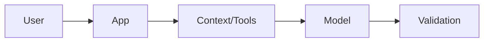
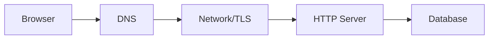

# Day 01 — The AI application stack + What happens when you type a URL?

!!! tip "Daily reps (~60–90 min)"
    Do both cards. Run each DO THIS lab, answer each checkpoint aloud before rereading.

## AI card — The AI application stack

**What to learn, in order:** Learn to see an AI product as model + context + tools + deterministic code + storage + evals + operations, not "just a prompt".

**Linear learning path**

1. Trace one request from user input to model output
2. Separate deterministic logic from model judgment
3. Name quality, latency, cost, and reliability as first-class constraints
4. Identify which components must be observable

!!! example "DO THIS"
    Draw the architecture of one AI app you already know and label every non-model dependency.

!!! question "Mid-senior checkpoint"
    If the model is only 20% of the product, where should most production bugs be expected?

**Sources**

- Required: [Building LLM Applications for Production - Chip Huyen](https://huyenchip.com/2023/04/11/llm-engineering.html) — Frames an LLM product as an end-to-end system with quality, latency, cost, and reliability constraints.
- Official / deep: [Production Best Practices - OpenAI](https://developers.openai.com/api/docs/guides/production-best-practices) — Production checklist for reliability, latency, usage limits, and operational safeguards.

---

## System Design card — What happens when you type a URL?

**What to learn, in order:** Build the end-to-end mental model for the web request path before studying any distributed component in isolation.

**Linear learning path**

1. Resolve a name to an IP
2. Establish network/security transport
3. Send an HTTP request through intermediaries
4. Follow the request into application and data tiers

!!! example "DO THIS"
    Use curl -v on a public site and identify DNS, connection, TLS, request, and response stages.

!!! question "Mid-senior checkpoint"
    At which stages can latency or failure occur before your application code even runs?

**Sources**

- Required: [Client-Server Overview - MDN](https://developer.mozilla.org/en-US/docs/Learn_web_development/Extensions/Server-side/First_steps/Client-Server_overview) — Explains the basic request-response relationship between clients, servers, applications, and data stores.
- Official / deep: [Overview of HTTP - MDN](https://developer.mozilla.org/en-US/docs/Web/HTTP/Guides/Overview) — Explains methods, headers, responses, intermediaries, caching, and stateless request semantics.

---
*Source: `60_Days_AI_Engineering_System_Design_Roadmap_Anup_Dangi.pdf`, Day 01 cards. [Suggest a correction](https://github.com/AnupDangi/learnlikeadev/issues/new)*
