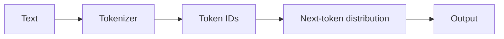
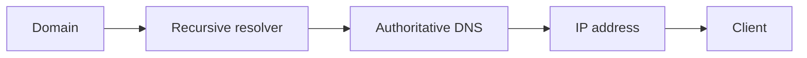

# Day 02 — Tokens and autoregressive generation + DNS and name resolution

!!! tip "Daily reps (~60–90 min)"
    Do both cards. Run each DO THIS lab, answer each checkpoint aloud before rereading.

## AI card — Tokens and autoregressive generation

**What to learn, in order:** Understand what the model actually consumes and why output length dominates interactive generation latency.

**Linear learning path**

1. Tokenize text and inspect token IDs
2. Understand next-token conditional probability
3. Compare greedy, temperature, and top-p decoding
4. Connect output tokens to cost and latency

!!! example "DO THIS"
    Tokenize the same paragraph with two tokenizers and compare token counts.

!!! question "Mid-senior checkpoint"
    Why can two prompts with similar character length have very different cost?

**Sources**

- Required: [Deep Dive into Text Generation - Hugging Face](https://huggingface.co/learn/llm-course/chapter1/8) — Explains autoregressive generation and the mechanics behind next-token decoding.
- Official / deep: [Prompt Engineering - Lilian Weng](https://lilianweng.github.io/posts/2023-03-15-prompt-engineering/) — Surveys prompting techniques such as few-shot prompting, decomposition, reasoning, self-consistency, and ReAct.

---

## System Design card — DNS and name resolution

**What to learn, in order:** Understand how names become routable destinations and why caching makes DNS both fast and occasionally stale.

**Linear learning path**

1. Recursive versus authoritative resolution
2. A/AAAA/CNAME records
3. TTL and resolver caches
4. Failure modes during record changes

!!! example "DO THIS"
    Use dig/nslookup and trace the records for one domain you own or know.

!!! question "Mid-senior checkpoint"
    What happens during a deployment if clients keep an old DNS answer longer than expected?

**Sources**

- Required: [What is DNS? - Cloudflare](https://www.cloudflare.com/learning/dns/what-is-dns/) — Explains recursive resolution, authoritative servers, DNS records, and why name resolution precedes application traffic.
- Official / deep: [DNS Concepts - RFC 1034](https://www.rfc-editor.org/rfc/rfc1034) — Original DNS concepts and architecture reference.

---
*Source: `60_Days_AI_Engineering_System_Design_Roadmap_Anup_Dangi.pdf`, Day 02 cards. [Suggest a correction](https://github.com/AnupDangi/learnlikeadev/issues/new)*
