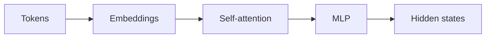
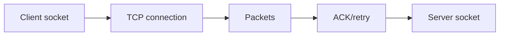

# Day 03 — Transformer intuition: embeddings, attention, MLP + TCP and reliable transport

!!! tip "Daily reps (~60–90 min)"
    Do both cards. Run each DO THIS lab, answer each checkpoint aloud before rereading.

## AI card — Transformer intuition: embeddings, attention, MLP

**What to learn, in order:** Build the minimum internal model needed to understand context, attention, KV cache, and inference behavior later.

**Linear learning path**

1. Map token IDs to embeddings
2. See self-attention as content-dependent mixing
3. Understand the role of the feed-forward/MLP block
4. Follow residual connections through layers

!!! example "DO THIS"
    Walk one short sentence through an annotated Transformer implementation and label tensor shapes.

!!! question "Mid-senior checkpoint"
    Which parts of the Transformer depend on sequence length and which depend mostly on model width?

**Sources**

- Required: [The Annotated Transformer - Harvard NLP](https://nlp.seas.harvard.edu/annotated-transformer/) — Walks through a Transformer implementation and connects the paper to working code.
- Official / deep: [Attention Is All You Need - Vaswani et al.](https://arxiv.org/abs/1706.03762) — The canonical Transformer paper: self-attention, multi-head attention, residual paths, and positional encoding.

---

## System Design card — TCP and reliable transport

**What to learn, in order:** Understand how reliable byte streams are created over unreliable networks and why application latency includes transport behavior.

**Linear learning path**

1. Connection state and sequence numbers
2. ACKs and retransmission
3. Flow/congestion control intuition
4. Connection setup and failure

!!! example "DO THIS"
    Capture a TCP connection with a packet analyzer and identify SYN, ACK, data, and FIN/RST.

!!! question "Mid-senior checkpoint"
    Why can packet loss increase application latency even when servers are healthy?

**Sources**

- Required: [TCP Specification - RFC 9293](https://www.rfc-editor.org/rfc/rfc9293) — Canonical reference for reliable byte streams, connection state, sequence numbers, retransmission, and flow control.
- Official / deep: [Overview of HTTP - MDN](https://developer.mozilla.org/en-US/docs/Web/HTTP/Guides/Overview) — Explains methods, headers, responses, intermediaries, caching, and stateless request semantics.

---
*Source: `60_Days_AI_Engineering_System_Design_Roadmap_Anup_Dangi.pdf`, Day 03 cards. [Suggest a correction](https://github.com/AnupDangi/learnlikeadev/issues/new)*
