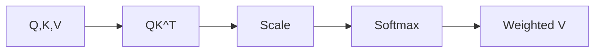
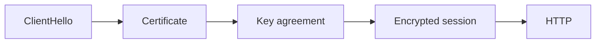

# Day 04 — Attention mathematically + TLS and secure sessions

!!! tip "Daily reps (~60–90 min)"
    Do both cards. Run each DO THIS lab, answer each checkpoint aloud before rereading.

## AI card — Attention mathematically

**What to learn, in order:** Move from intuition to the actual attention equation and interpret every term.

**Linear learning path**

1. Construct Q, K, and V
2. Compute scaled dot products
3. Apply softmax weights
4. Explain why multiple heads can learn different relationships

!!! example "DO THIS"
    Calculate attention for 3 toy tokens with 2-dimensional vectors by hand or in Python.

!!! question "Mid-senior checkpoint"
    What does changing one key vector do to every query that attends to it?

**Sources**

- Required: [Attention Is All You Need - Vaswani et al.](https://arxiv.org/abs/1706.03762) — The canonical Transformer paper: self-attention, multi-head attention, residual paths, and positional encoding.
- Official / deep: [The Annotated Transformer - Harvard NLP](https://nlp.seas.harvard.edu/annotated-transformer/) — Walks through a Transformer implementation and connects the paper to working code.

---

## System Design card — TLS and secure sessions

**What to learn, in order:** Understand where identity, encryption, and key agreement enter the request path.

**Linear learning path**

1. ClientHello/ServerHello intuition
2. Certificate verification
3. Key agreement
4. Session resumption and latency

!!! example "DO THIS"
    Open browser certificate details for a site and identify issuer, subject, validity, and SANs.

!!! question "Mid-senior checkpoint"
    What fails when a certificate is valid cryptographically but issued for the wrong hostname?

**Sources**

- Required: [What Happens in a TLS Handshake? - Cloudflare](https://www.cloudflare.com/learning/ssl/what-happens-in-a-tls-handshake/) — Explains certificates, key agreement, identity verification, and how secure sessions are established.
- Official / deep: [Overview of HTTP - MDN](https://developer.mozilla.org/en-US/docs/Web/HTTP/Guides/Overview) — Explains methods, headers, responses, intermediaries, caching, and stateless request semantics.

---
*Source: `60_Days_AI_Engineering_System_Design_Roadmap_Anup_Dangi.pdf`, Day 04 cards. [Suggest a correction](https://github.com/AnupDangi/learnlikeadev/issues/new)*
