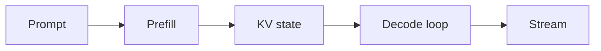
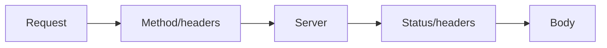

# Day 05 — Inference lifecycle: prefill vs decode + HTTP semantics

!!! tip "Daily reps (~60–90 min)"
    Do both cards. Run each DO THIS lab, answer each checkpoint aloud before rereading.

## AI card — Inference lifecycle: prefill vs decode

**What to learn, in order:** Learn why processing the prompt and generating tokens are different computational phases.

**Linear learning path**

1. Prefill processes prompt tokens in parallel
2. Decode generates tokens autoregressively
3. TTFT differs from inter-token latency
4. Separate model latency from network/tool latency

!!! example "DO THIS"
    Measure time-to-first-token and total response time for short vs long outputs.

!!! question "Mid-senior checkpoint"
    Why can halving output length reduce latency more than halving prompt length?

**Sources**

- Required: [Latency Optimization - OpenAI](https://developers.openai.com/api/docs/guides/latency-optimization) — Explains how model choice, token count, request count, parallelism, and UI design affect end-to-end latency.
- Official / deep: [Production Best Practices - OpenAI](https://developers.openai.com/api/docs/guides/production-best-practices) — Production checklist for reliability, latency, usage limits, and operational safeguards.

---

## System Design card — HTTP semantics

**What to learn, in order:** Learn the protocol contract applications depend on: method, URI, headers, status, caching, and statelessness.

**Linear learning path**

1. GET/POST/PUT/PATCH/DELETE semantics
2. Status-code classes
3. Headers and representation metadata
4. Stateless requests and intermediaries

!!! example "DO THIS"
    Inspect request/response headers with curl and explain every important field.

!!! question "Mid-senior checkpoint"
    Why does "stateless HTTP" not mean your application has no state?

**Sources**

- Required: [Overview of HTTP - MDN](https://developer.mozilla.org/en-US/docs/Web/HTTP/Guides/Overview) — Explains methods, headers, responses, intermediaries, caching, and stateless request semantics.
- Official / deep: [APIs as Infrastructure: Stripe API Versioning](https://stripe.com/blog/api-versioning) — Shows how to evolve a public API without silently breaking old clients.

---
*Source: `60_Days_AI_Engineering_System_Design_Roadmap_Anup_Dangi.pdf`, Day 05 cards. [Suggest a correction](https://github.com/AnupDangi/learnlikeadev/issues/new)*
