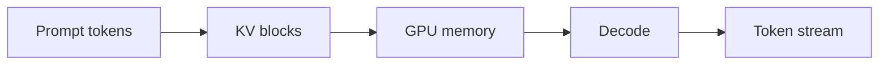
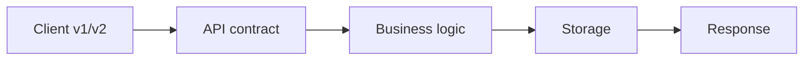

# Day 06 — KV cache and inference memory + API contracts and versioning

!!! tip "Daily reps (~60–90 min)"
    Do both cards. Run each DO THIS lab, answer each checkpoint aloud before rereading.

## AI card — KV cache and inference memory

**What to learn, in order:** Understand why active context becomes a memory resource and why LLM server capacity is not simply requests/second.

**Linear learning path**

1. Keys/values can be reused during decode
2. KV memory scales with active tokens
3. Long contexts reduce concurrent capacity
4. Memory fragmentation motivates paged allocation

!!! example "DO THIS"
    Estimate KV-cache memory for a hypothetical model and 8k-token sequence.

!!! question "Mid-senior checkpoint"
    Why can a 24GB GPU serve many short conversations but only a few very long ones?

**Sources**

- Required: [vLLM: PagedAttention and High-throughput LLM Serving](https://arxiv.org/abs/2309.06180) — Explains KV-cache memory pressure, PagedAttention, and why serving throughput is a scheduling and memory problem.
- Official / deep: [vLLM - Open-source LLM inference and serving engine](https://github.com/vllm-project/vllm) — Implementation reference for continuous batching, paged KV cache, OpenAI-compatible serving, and benchmarks.

---

## System Design card — API contracts and versioning

**What to learn, in order:** Treat APIs as long-lived compatibility contracts rather than convenient function calls.

**Linear learning path**

1. Resource and endpoint design
2. Backward compatibility
3. Idempotency and error contracts
4. Versioning and deprecation strategy

!!! example "DO THIS"
    Design v1 and v2 of a /payments endpoint while keeping one old client working.

!!! question "Mid-senior checkpoint"
    What is the migration cost of changing the meaning of a field without changing its name?

**Sources**

- Required: [APIs as Infrastructure: Stripe API Versioning](https://stripe.com/blog/api-versioning) — Shows how to evolve a public API without silently breaking old clients.
- Official / deep: [Idempotent Requests - Stripe](https://docs.stripe.com/api/idempotent_requests) — Shows how API clients safely retry write operations using stable idempotency keys.

---
*Source: `60_Days_AI_Engineering_System_Design_Roadmap_Anup_Dangi.pdf`, Day 06 cards. [Suggest a correction](https://github.com/AnupDangi/learnlikeadev/issues/new)*
