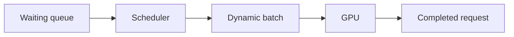
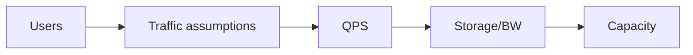

# Day 07 — Continuous batching and serving throughput + Back-of-envelope capacity estimation

!!! tip "Daily reps (~60–90 min)"
    Do both cards. Run each DO THIS lab, answer each checkpoint aloud before rereading.

## AI card — Continuous batching and serving throughput

**What to learn, in order:** Learn how inference schedulers mix active sequences rather than waiting for whole static batches to finish.

**Linear learning path**

1. Static batching wastes slots on finished requests
2. Continuous batching replaces completed sequences
3. Prompt/decode work have different costs
4. Throughput depends on scheduler and memory pressure

!!! example "DO THIS"
    Run a serving benchmark with concurrency 1, 4, 16, and 64 and record tokens/sec and p95 latency.

!!! question "Mid-senior checkpoint"
    Why can throughput rise while p99 latency becomes unacceptable?

**Sources**

- Required: [vLLM - Open-source LLM inference and serving engine](https://github.com/vllm-project/vllm) — Implementation reference for continuous batching, paged KV cache, OpenAI-compatible serving, and benchmarks.
- Official / deep: [vLLM: PagedAttention and High-throughput LLM Serving](https://arxiv.org/abs/2309.06180) — Explains KV-cache memory pressure, PagedAttention, and why serving throughput is a scheduling and memory problem.

---

## System Design card — Back-of-envelope capacity estimation

**What to learn, in order:** Turn product scale into rough QPS, storage, bandwidth, and worker requirements before choosing technologies.

**Linear learning path**

1. Average vs peak QPS
2. Read/write ratio
3. Storage growth per day/year
4. Bandwidth and concurrency estimates

!!! example "DO THIS"
    Estimate a 10M-user product: DAU, requests/day, peak QPS, annual storage, and egress.

!!! question "Mid-senior checkpoint"
    Which estimate is most sensitive to a 10x error and why?

**Sources**

- Required: [Google Cloud Architecture Framework](https://cloud.google.com/architecture/framework) — High-level framework for capacity, reliability, performance, operations, and architecture trade-offs.
- Official / deep: [AWS Architecture Center](https://aws.amazon.com/architecture/) — Broad reference collection for real cloud architectures, patterns, scaling, and operational trade-offs.

---
*Source: `60_Days_AI_Engineering_System_Design_Roadmap_Anup_Dangi.pdf`, Day 07 cards. [Suggest a correction](https://github.com/AnupDangi/learnlikeadev/issues/new)*
