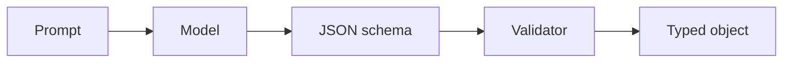
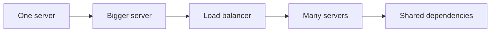

# Day 08 — Structured outputs and typed AI interfaces + Vertical vs horizontal scaling

!!! tip "Daily reps (~60–90 min)"
    Do both cards. Run each DO THIS lab, answer each checkpoint aloud before rereading.

## AI card — Structured outputs and typed AI interfaces

**What to learn, in order:** Replace brittle string parsing with schemas the application can validate and reason about.

**Linear learning path**

1. Define output schemas
2. Use enums and required fields
3. Validate and reject malformed outputs
4. Keep deterministic business rules outside prose generation

!!! example "DO THIS"
    Wrap one extraction task in a Pydantic/JSON schema and test 20 inputs.

!!! question "Mid-senior checkpoint"
    When should validation fail closed instead of asking the model to repair itself?

**Sources**

- Required: [Structured Outputs - OpenAI](https://developers.openai.com/api/docs/guides/structured-outputs) — Shows how to turn probabilistic text generation into schema-constrained program interfaces.
- Official / deep: [Pydantic Documentation](https://docs.pydantic.dev/latest/) — Implementation reference for typed validation and schema-driven application contracts.

---

## System Design card — Vertical vs horizontal scaling

**What to learn, in order:** Understand why scale-up is simple but bounded, while scale-out requires statelessness, routing, and coordination.

**Linear learning path**

1. Scale-up vs scale-out
2. Failure domains
3. Shared state challenges
4. When one large machine is still the right answer

!!! example "DO THIS"
    Take a single-server web app and sketch the changes required to run 5 replicas.

!!! question "Mid-senior checkpoint"
    What hidden local state prevents an application from scaling horizontally?

**Sources**

- Required: [Google Cloud Architecture Framework](https://cloud.google.com/architecture/framework) — High-level framework for capacity, reliability, performance, operations, and architecture trade-offs.
- Official / deep: [HTTP Load Balancing - NGINX](https://nginx.org/en/docs/http/load_balancing.html) — Official reference for round-robin, least-connections, IP-hash routing, and balancing across backend servers.

---
*Source: `60_Days_AI_Engineering_System_Design_Roadmap_Anup_Dangi.pdf`, Day 08 cards. [Suggest a correction](https://github.com/AnupDangi/learnlikeadev/issues/new)*
