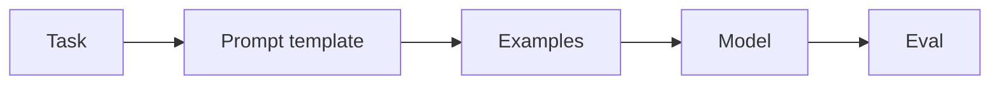
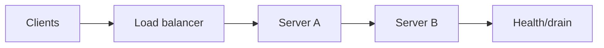

# Day 09 — Prompt engineering as software engineering + Load balancing and health checks

!!! tip "Daily reps (~60–90 min)"
    Do both cards. Run each DO THIS lab, answer each checkpoint aloud before rereading.

## AI card — Prompt engineering as software engineering

**What to learn, in order:** Treat prompts as versioned program artifacts with tests, examples, and explicit contracts.

**Linear learning path**

1. Instruction hierarchy
2. Few-shot examples
3. Decomposition and constraints
4. Prompt regression tests

!!! example "DO THIS"
    Create a prompt test suite with 20 cases, then intentionally break one instruction and observe failures.

!!! question "Mid-senior checkpoint"
    Why is "the prompt looked better" not a valid release criterion?

**Sources**

- Required: [Prompt Engineering - Lilian Weng](https://lilianweng.github.io/posts/2023-03-15-prompt-engineering/) — Surveys prompting techniques such as few-shot prompting, decomposition, reasoning, self-consistency, and ReAct.
- Official / deep: [Prompting Guide - OpenAI](https://developers.openai.com/api/docs/guides/prompting) — Current prompt construction and prompt-test guidance.

---

## System Design card — Load balancing and health checks

**What to learn, in order:** Learn how a fleet becomes one logical service and why routing policy changes tail latency and failure behavior.

**Linear learning path**

1. Round robin vs least connections
2. Health checks
3. Connection draining
4. Affinity and its trade-offs

!!! example "DO THIS"
    Put 3 local HTTP servers behind NGINX and kill one while sending traffic.

!!! question "Mid-senior checkpoint"
    When does sticky routing improve locality but hurt resilience?

**Sources**

- Required: [HTTP Load Balancing - NGINX](https://nginx.org/en/docs/http/load_balancing.html) — Official reference for round-robin, least-connections, IP-hash routing, and balancing across backend servers.
- Official / deep: [NGINX Request Limiting](https://nginx.org/en/docs/http/ngx_http_limit_req_module.html) — Shows how front-door routing layers can also enforce admission limits.

---
*Source: `60_Days_AI_Engineering_System_Design_Roadmap_Anup_Dangi.pdf`, Day 09 cards. [Suggest a correction](https://github.com/AnupDangi/learnlikeadev/issues/new)*
