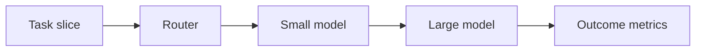
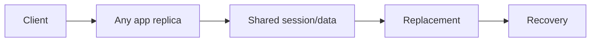

# Day 10 — Model selection: quality, latency, cost + Stateless services and session design

!!! tip "Daily reps (~60–90 min)"
    Do both cards. Run each DO THIS lab, answer each checkpoint aloud before rereading.

## AI card — Model selection: quality, latency, cost

**What to learn, in order:** Choose the smallest/fastest model that satisfies a measured workload rather than defaulting to one model for everything.

**Linear learning path**

1. Define workload slices
2. Compare quality per slice
3. Measure latency and cost
4. Route by difficulty or risk

!!! example "DO THIS"
    Benchmark 2 models on 30 representative tasks and plot quality vs cost.

!!! question "Mid-senior checkpoint"
    When is a more expensive model actually cheaper at the product level?

**Sources**

- Required: [Model Selection Guide - OpenAI](https://developers.openai.com/api/docs/guides/latest-model) — Useful for thinking about workload-model fit rather than defaulting to the largest model.
- Official / deep: [API Deployment Checklist - OpenAI](https://developers.openai.com/api/docs/guides/deployment-checklist) — Current deployment checklist spanning model choice, reasoning budgets, tools, compaction, caching, and reliability.

---

## System Design card — Stateless services and session design

**What to learn, in order:** Learn why local mutable state creates scaling and failover problems.

**Linear learning path**

1. Stateless process principle
2. External session stores
3. Sticky sessions vs portable sessions
4. Replacement and autoscaling

!!! example "DO THIS"
    Move an in-memory login session to Redis or a signed token and then run two app replicas.

!!! question "Mid-senior checkpoint"
    Which state truly belongs to the process, and which must survive process death?

**Sources**

- Required: [The Twelve-Factor App: Processes](https://12factor.net/processes) — Explains why stateless share-nothing application processes make horizontal scaling and replacement easier.
- Official / deep: [Redis Documentation](https://redis.io/docs/latest/) — Reference for in-memory data structures, caching, persistence, replication, clustering, and operational behavior.

---
*Source: `60_Days_AI_Engineering_System_Design_Roadmap_Anup_Dangi.pdf`, Day 10 cards. [Suggest a correction](https://github.com/AnupDangi/learnlikeadev/issues/new)*
