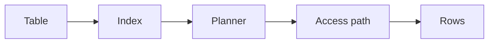

# Day 12 — Cosine similarity and vector retrieval + Indexes and query access paths

!!! tip "Daily reps (~60–90 min)"
    Do both cards. Run each DO THIS lab, answer each checkpoint aloud before rereading.

## AI card — Cosine similarity and vector retrieval

**What to learn, in order:** Move from "embeddings are vectors" to the actual similarity calculation used by retrievers.

**Linear learning path**

1. Normalize vectors
2. Compute cosine similarity
3. Understand dot product vs cosine
4. Use thresholds carefully

!!! example "DO THIS"
    Compute similarity for 5 toy vectors by hand and verify with code.

!!! question "Mid-senior checkpoint"
    Why can a fixed similarity threshold behave differently across embedding models?

**Sources**

- Required: [Vector Embeddings - OpenAI](https://developers.openai.com/api/docs/guides/embeddings) — Introduces embeddings, similarity, and common semantic-search use cases.
- Official / deep: [Sentence Transformers Documentation](https://www.sbert.net/) — Practical reference for bi-encoders, semantic similarity, retrieval, and embedding evaluation.

---

## System Design card — Indexes and query access paths

**What to learn, in order:** Understand why an index accelerates some queries, slows writes, and can still be ignored by the planner.

**Linear learning path**

1. B-tree mental model
2. Selectivity
3. Composite index ordering
4. EXPLAIN and query planner choices

!!! example "DO THIS"
    Create a 1M-row table, benchmark an indexed lookup before/after the index, then inspect EXPLAIN.

!!! question "Mid-senior checkpoint"
    Why is "this column is indexed" not proof that the query is efficient?

**Sources**

- Required: [PostgreSQL Index Types](https://www.postgresql.org/docs/current/indexes-types.html) — Explains B-tree, hash, GiST, GIN, SP-GiST, and BRIN indexes and the access patterns they support.
- Official / deep: [Using EXPLAIN - PostgreSQL](https://www.postgresql.org/docs/current/using-explain.html) — Official guide to understanding query plans and index usage.

---
*Source: `60_Days_AI_Engineering_System_Design_Roadmap_Anup_Dangi.pdf`, Day 12 cards. [Suggest a correction](https://github.com/AnupDangi/learnlikeadev/issues/new)*
