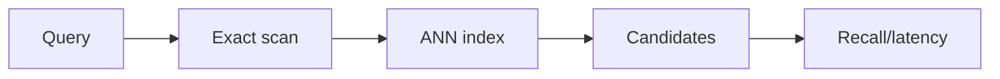
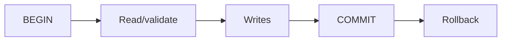

# Day 13 — Exact vs approximate nearest-neighbor search + Transactions and ACID

!!! tip "Daily reps (~60–90 min)"
    Do both cards. Run each DO THIS lab, answer each checkpoint aloud before rereading.

## AI card — Exact vs approximate nearest-neighbor search

**What to learn, in order:** Understand when scanning every vector stops being practical and what ANN gives up for speed.

**Linear learning path**

1. Flat/exact search
2. Recall vs latency
3. Candidate pruning
4. Memory/index-build trade-offs

!!! example "DO THIS"
    Compare FAISS IndexFlat with one ANN index on the same 100k vectors.

!!! question "Mid-senior checkpoint"
    What recall loss is acceptable when retrieved evidence feeds an LLM?

**Sources**

- Required: [FAISS Index Guide](https://github.com/facebookresearch/faiss/wiki/Guidelines-to-choose-an-index) — Explains exact versus approximate search and how to choose indexes based on scale, memory, and recall.
- Official / deep: [pgvector - Vector Similarity Search for Postgres](https://github.com/pgvector/pgvector) — Concrete implementation reference for exact search, HNSW, IVFFlat, filtering, and SQL integration.

---

## System Design card — Transactions and ACID

**What to learn, in order:** Treat a transaction as a correctness boundary for multiple dependent writes.

**Linear learning path**

1. Atomicity
2. Consistency as application invariants
3. Isolation
4. Durability

!!! example "DO THIS"
    Implement a money transfer and force an exception between debit and credit.

!!! question "Mid-senior checkpoint"
    Which partial states must be impossible even if the process crashes?

**Sources**

- Required: [PostgreSQL Transactions Tutorial](https://www.postgresql.org/docs/current/tutorial-transactions.html) — Canonical introduction to BEGIN, COMMIT, ROLLBACK, atomic multi-step operations, and savepoints.
- Official / deep: [PostgreSQL Transaction Isolation](https://www.postgresql.org/docs/current/transaction-iso.html) — Explains isolation levels, anomalies, snapshots, serialization failures, and concurrency semantics.

---
*Source: `60_Days_AI_Engineering_System_Design_Roadmap_Anup_Dangi.pdf`, Day 13 cards. [Suggest a correction](https://github.com/AnupDangi/learnlikeadev/issues/new)*
