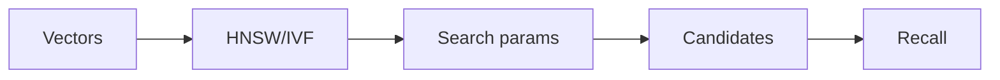
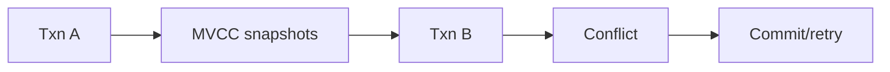

# Day 14 — HNSW and IVF internally + MVCC and transaction isolation

!!! tip "Daily reps (~60–90 min)"
    Do both cards. Run each DO THIS lab, answer each checkpoint aloud before rereading.

## AI card — HNSW and IVF internally

**What to learn, in order:** Learn two common ANN families well enough to reason about memory, build cost, and query-time tuning.

**Linear learning path**

1. HNSW graph navigation
2. IVF coarse partitioning
3. Search breadth/probe controls
4. Recall-memory-latency trade-offs

!!! example "DO THIS"
    Build HNSW and IVFFlat indexes with pgvector or FAISS and vary search parameters.

!!! question "Mid-senior checkpoint"
    Why can a faster ANN query still produce a worse end-to-end RAG product?

**Sources**

- Required: [pgvector - Vector Similarity Search for Postgres](https://github.com/pgvector/pgvector) — Concrete implementation reference for exact search, HNSW, IVFFlat, filtering, and SQL integration.
- Official / deep: [FAISS Index Guide](https://github.com/facebookresearch/faiss/wiki/Guidelines-to-choose-an-index) — Explains exact versus approximate search and how to choose indexes based on scale, memory, and recall.

---

## System Design card — MVCC and transaction isolation

**What to learn, in order:** Understand how concurrent transactions see snapshots and where anomalies still occur.

**Linear learning path**

1. Read Committed
2. Repeatable Read
3. Serializable
4. Serialization retry

!!! example "DO THIS"
    Run two database sessions and reproduce a non-repeatable read or write conflict.

!!! question "Mid-senior checkpoint"
    Which isolation level preserves your business invariant with the least coordination?

**Sources**

- Required: [PostgreSQL Transaction Isolation](https://www.postgresql.org/docs/current/transaction-iso.html) — Explains isolation levels, anomalies, snapshots, serialization failures, and concurrency semantics.
- Official / deep: [PostgreSQL Transactions Tutorial](https://www.postgresql.org/docs/current/tutorial-transactions.html) — Canonical introduction to BEGIN, COMMIT, ROLLBACK, atomic multi-step operations, and savepoints.

---
*Source: `60_Days_AI_Engineering_System_Design_Roadmap_Anup_Dangi.pdf`, Day 14 cards. [Suggest a correction](https://github.com/AnupDangi/learnlikeadev/issues/new)*
