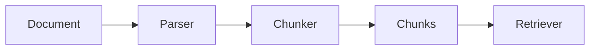
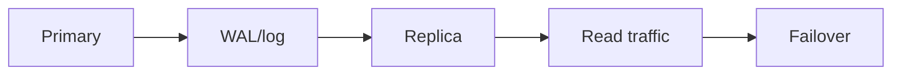

# Day 15 — Chunking strategies + Replication and failover

!!! tip "Daily reps (~60–90 min)"
    Do both cards. Run each DO THIS lab, answer each checkpoint aloud before rereading.

## AI card — Chunking strategies

**What to learn, in order:** Chunking is an information-architecture decision: it determines what the retriever can ever return.

**Linear learning path**

1. Fixed-size chunks
2. Sentence/section boundaries
3. Overlap
4. Hierarchical/semantic chunking

!!! example "DO THIS"
    Chunk one PDF three ways and compare retrieval results on 10 questions.

!!! question "Mid-senior checkpoint"
    When does larger context improve recall but reduce precision?

**Sources**

- Required: [Text Splitters - LangChain Concepts](https://python.langchain.com/docs/concepts/text_splitters/) — Practical taxonomy of chunking and splitting approaches used before retrieval.
- Official / deep: [Contextual Retrieval - Anthropic](https://www.anthropic.com/engineering/contextual-retrieval) — Shows why isolated chunks lose context and how contextualizing chunks can improve retrieval.

---

## System Design card — Replication and failover

**What to learn, in order:** Learn how copies improve read scale and availability while introducing lag and failover complexity.

**Linear learning path**

1. Primary/replica roles
2. Synchronous vs asynchronous replication
3. Replication lag
4. Failover and promotion

!!! example "DO THIS"
    Run a local primary/replica setup or inspect replication metrics in a managed DB.

!!! question "Mid-senior checkpoint"
    Can a successful write be missing after failover? Under what replication policy?

**Sources**

- Required: [PostgreSQL High Availability and Replication](https://www.postgresql.org/docs/current/high-availability.html) — Official overview of replication and availability patterns for PostgreSQL systems.
- Official / deep: [PostgreSQL Transaction Isolation](https://www.postgresql.org/docs/current/transaction-iso.html) — Explains isolation levels, anomalies, snapshots, serialization failures, and concurrency semantics.

---
*Source: `60_Days_AI_Engineering_System_Design_Roadmap_Anup_Dangi.pdf`, Day 15 cards. [Suggest a correction](https://github.com/AnupDangi/learnlikeadev/issues/new)*
