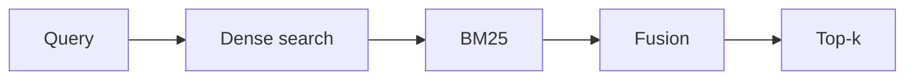
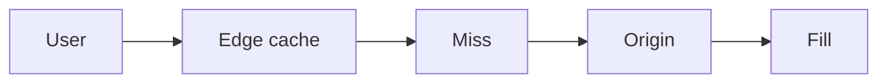

# Day 18 — Hybrid search + CDN and edge caching

!!! tip "Daily reps (~60–90 min)"
    Do both cards. Run each DO THIS lab, answer each checkpoint aloud before rereading.

## AI card — Hybrid search

**What to learn, in order:** Combine semantic and lexical retrieval because their failure modes are complementary.

**Linear learning path**

1. Dense retrieval strengths
2. BM25 strengths
3. Score fusion/rank fusion
4. Metadata filtering

!!! example "DO THIS"
    Build a two-stage hybrid retriever and compare against dense-only and lexical-only baselines.

!!! question "Mid-senior checkpoint"
    How do you normalize scores from two retrieval systems with different scales?

**Sources**

- Required: [Patterns for Building LLM-based Systems - Eugene Yan](https://eugeneyan.com/writing/llm-patterns/) — Connects retrieval, routing, generation, validation, caching, and evaluation into reusable system patterns.
- Official / deep: [BM25 Similarity - Elasticsearch](https://www.elastic.co/guide/en/elasticsearch/reference/current/index-modules-similarity.html) — Official implementation reference for lexical ranking and BM25-style scoring.

---

## System Design card — CDN and edge caching

**What to learn, in order:** Understand how geographically distributed caches remove origin work and network distance from common requests.

**Linear learning path**

1. Edge POP
2. Cache key
3. Hit/miss
4. Invalidation and stale content

!!! example "DO THIS"
    Serve a static asset through a CDN and inspect Age/Cache-Control headers across repeated requests.

!!! question "Mid-senior checkpoint"
    When is stale-but-fast content better than origin-consistent content?

**Sources**

- Required: [What is a CDN? - Cloudflare](https://www.cloudflare.com/learning/cdn/what-is-a-cdn/) — Explains edge caching, origin offload, geographic delivery, and cache-hit behavior.
- Official / deep: [HTTP Caching - MDN](https://developer.mozilla.org/en-US/docs/Web/HTTP/Caching) — Reference for Cache-Control, validators, freshness, and shared/private caches.

---
*Source: `60_Days_AI_Engineering_System_Design_Roadmap_Anup_Dangi.pdf`, Day 18 cards. [Suggest a correction](https://github.com/AnupDangi/learnlikeadev/issues/new)*
