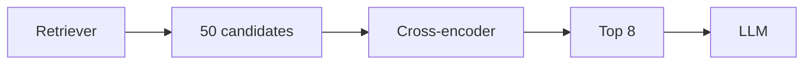
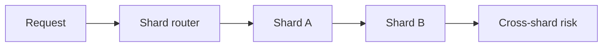

# Day 19 — Reranking + Database partitioning and sharding

!!! tip "Daily reps (~60–90 min)"
    Do both cards. Run each DO THIS lab, answer each checkpoint aloud before rereading.

## AI card — Reranking

**What to learn, in order:** Use a stronger pairwise model after high-recall retrieval to improve the precision of context sent to the LLM.

**Linear learning path**

1. First-stage retrieval
2. Cross-encoder scoring
3. Top-N to top-k reduction
4. Latency/quality trade-off

!!! example "DO THIS"
    Retrieve 50 candidates, rerank them, and compare nDCG or answer accuracy.

!!! question "Mid-senior checkpoint"
    How much reranker latency is justified by a small precision gain?

**Sources**

- Required: [Cross-Encoder Reranking - Sentence Transformers](https://www.sbert.net/examples/cross_encoder/applications/README.html) — Shows how rerankers trade extra compute for higher precision after first-stage retrieval.
- Official / deep: [Patterns for Building LLM-based Systems - Eugene Yan](https://eugeneyan.com/writing/llm-patterns/) — Connects retrieval, routing, generation, validation, caching, and evaluation into reusable system patterns.

---

## System Design card — Database partitioning and sharding

**What to learn, in order:** Split data by ownership boundaries while accounting for cross-shard joins, transactions, and hot partitions.

**Linear learning path**

1. Choose shard key
2. Routing layer
3. Cross-shard operations
4. Online migration

!!! example "DO THIS"
    Shard a toy dataset by tenant_id and list every query that becomes cross-shard.

!!! question "Mid-senior checkpoint"
    Which key gives locality without concentrating the busiest tenants?

**Sources**

- Required: [Partitioning GitHub Relational Databases](https://github.blog/engineering/infrastructure/partitioning-githubs-relational-databases-scale/) — Real migration showing how a large relational system moves toward partitioned database clusters.
- Official / deep: [Eliminating Cold Starts 2: Shard and Conquer - Cloudflare](https://blog.cloudflare.com/eliminating-cold-starts-2-shard-and-conquer/) — Production example of consistent hashing, stable ownership, locality, and remapping under node churn.

---
*Source: `60_Days_AI_Engineering_System_Design_Roadmap_Anup_Dangi.pdf`, Day 19 cards. [Suggest a correction](https://github.com/AnupDangi/learnlikeadev/issues/new)*
