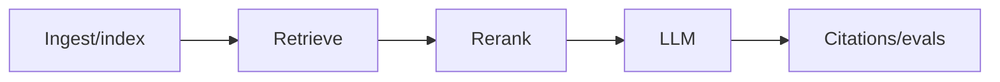
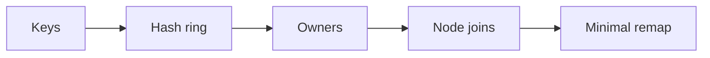

# Day 20 — Production RAG and retrieval evaluation + Consistent hashing and virtual nodes

!!! tip "Daily reps (~60–90 min)"
    Do both cards. Run each DO THIS lab, answer each checkpoint aloud before rereading.

## AI card — Production RAG and retrieval evaluation

**What to learn, in order:** Join ingestion, indexing, search, reranking, generation, citations, permissions, and evals into one measured system.

**Linear learning path**

1. Evaluate retrieval separately from generation
2. Track freshness and permissions
3. Measure Recall@k/MRR/nDCG
4. Verify claims against retrieved evidence

!!! example "DO THIS"
    Create a 30-question retrieval eval set and compare at least two pipelines.

!!! question "Mid-senior checkpoint"
    If answer quality is low, how do you prove whether retrieval or generation is responsible?

**Sources**

- Required: [Contextual Retrieval - Anthropic](https://www.anthropic.com/engineering/contextual-retrieval) — Shows why isolated chunks lose context and how contextualizing chunks can improve retrieval.
- Official / deep: [Evaluation of Ranked Retrieval - Stanford IR Book](https://nlp.stanford.edu/IR-book/html/htmledition/evaluation-of-ranked-retrieval-results-1.html) — Classic reference for precision, recall, MAP, and ranked-retrieval evaluation.

---

## System Design card — Consistent hashing and virtual nodes

**What to learn, in order:** Preserve ownership locality while minimizing remapping when a distributed fleet changes membership.

**Linear learning path**

1. Hash ring mental model
2. Virtual nodes
3. Node join/leave
4. Hot-key limitations

!!! example "DO THIS"
    Simulate 10k keys on 10 nodes with modulo hashing vs consistent hashing, then add one node.

!!! question "Mid-senior checkpoint"
    Why does balanced key count not guarantee balanced traffic?

**Sources**

- Required: [Eliminating Cold Starts 2: Shard and Conquer - Cloudflare](https://blog.cloudflare.com/eliminating-cold-starts-2-shard-and-conquer/) — Production example of consistent hashing, stable ownership, locality, and remapping under node churn.
- Official / deep: [Dynamo: Amazon Highly Available Key-value Store](https://www.allthingsdistributed.com/files/amazon-dynamo-sosp2007.pdf) — Classic system covering consistent hashing, quorums, eventual consistency, vector clocks, and always-on availability.

---
*Source: `60_Days_AI_Engineering_System_Design_Roadmap_Anup_Dangi.pdf`, Day 20 cards. [Suggest a correction](https://github.com/AnupDangi/learnlikeadev/issues/new)*
