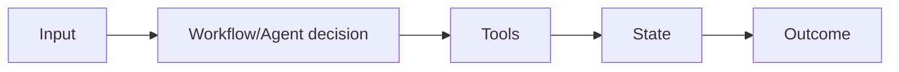

# Day 21 — Workflow vs agent + Time and ordering in distributed systems

!!! tip "Daily reps (~60–90 min)"
    Do both cards. Run each DO THIS lab, answer each checkpoint aloud before rereading.

## AI card — Workflow vs agent

**What to learn, in order:** Use deterministic workflows when the path is known; use agents only where adaptive decision-making is valuable.

**Linear learning path**

1. Workflow: predefined control flow
2. Agent: model chooses next action
3. Escalate complexity gradually
4. Keep deterministic steps deterministic

!!! example "DO THIS"
    Take one multi-step AI feature and write both a workflow and agent design.

!!! question "Mid-senior checkpoint"
    What evidence justifies giving control-flow authority to the model?

**Sources**

- Required: [Building Effective Agents - Anthropic](https://www.anthropic.com/engineering/building-effective-agents) — Defines workflows versus agents and argues for simple composable patterns before complex frameworks.
- Official / deep: [A Practical Guide to Building AI Agents - OpenAI](https://openai.com/business/guides-and-resources/a-practical-guide-to-building-ai-agents/) — Production-oriented overview of when to use agents, how to orchestrate them, and how to apply safeguards.

---

## System Design card — Time and ordering in distributed systems

**What to learn, in order:** Understand why wall-clock timestamps alone cannot reliably express causal ordering across machines.

**Linear learning path**

1. Clock skew
2. Events and happens-before
3. Logical time
4. Ordering vs real time

!!! example "DO THIS"
    Simulate two processes with unsynchronized clocks and generate an impossible-looking timestamp order.

!!! question "Mid-senior checkpoint"
    Which decisions require causal ordering rather than physical time?

**Sources**

- Required: [Time, Clocks, and the Ordering of Events - Lamport](https://lamport.azurewebsites.net/pubs/time-clocks.pdf) — Foundational paper for reasoning about event ordering and causality without relying on synchronized wall clocks.
- Official / deep: [Dapper: Large-Scale Distributed Tracing Infrastructure - Google](https://research.google/pubs/dapper-a-large-scale-distributed-systems-tracing-infrastructure/) — Foundational tracing paper for reconstructing one request across many distributed services.

---
*Source: `60_Days_AI_Engineering_System_Design_Roadmap_Anup_Dangi.pdf`, Day 21 cards. [Suggest a correction](https://github.com/AnupDangi/learnlikeadev/issues/new)*
