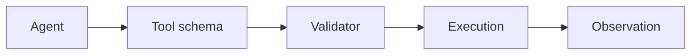
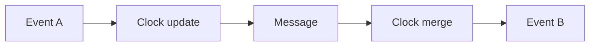

# Day 22 — Tool and API design for agents + Causality and Lamport clocks

!!! tip "Daily reps (~60–90 min)"
    Do both cards. Run each DO THIS lab, answer each checkpoint aloud before rereading.

## AI card — Tool and API design for agents

**What to learn, in order:** A tool is an interface contract the model must discover, select, populate, and interpret correctly.

**Linear learning path**

1. Clear tool boundaries
2. Typed arguments
3. Compact useful outputs
4. Action-specific errors

!!! example "DO THIS"
    Redesign 5 existing API endpoints into agent tools and remove ambiguous parameters.

!!! question "Mid-senior checkpoint"
    Which tool mistakes should be impossible by schema rather than discouraged by prompt?

**Sources**

- Required: [Writing Effective Tools for Agents - Anthropic](https://www.anthropic.com/engineering/writing-tools-for-agents) — Shows how tool naming, boundaries, output design, and evals affect agent performance.
- Official / deep: [Structured Outputs - OpenAI](https://developers.openai.com/api/docs/guides/structured-outputs) — Shows how to turn probabilistic text generation into schema-constrained program interfaces.

---

## System Design card — Causality and Lamport clocks

**What to learn, in order:** Learn the happens-before relation and what logical clocks can and cannot prove.

**Linear learning path**

1. Local increment
2. Message send/receive update
3. Causal order
4. Concurrent events

!!! example "DO THIS"
    Implement a Lamport clock for two simulated nodes exchanging messages.

!!! question "Mid-senior checkpoint"
    Why does C(a) < C(b) not necessarily prove that a caused b?

**Sources**

- Required: [Time, Clocks, and the Ordering of Events - Lamport](https://lamport.azurewebsites.net/pubs/time-clocks.pdf) — Foundational paper for reasoning about event ordering and causality without relying on synchronized wall clocks.
- Official / deep: [Dynamo: Amazon Highly Available Key-value Store](https://www.allthingsdistributed.com/files/amazon-dynamo-sosp2007.pdf) — Classic system covering consistent hashing, quorums, eventual consistency, vector clocks, and always-on availability.

---
*Source: `60_Days_AI_Engineering_System_Design_Roadmap_Anup_Dangi.pdf`, Day 22 cards. [Suggest a correction](https://github.com/AnupDangi/learnlikeadev/issues/new)*
