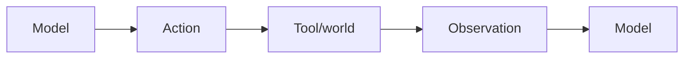
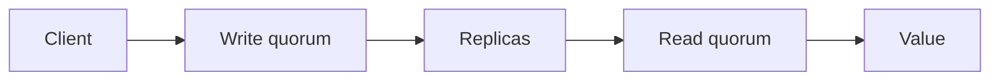

# Day 23 — ReAct and the agent execution loop + Quorums and replicated reads/writes

!!! tip "Daily reps (~60–90 min)"
    Do both cards. Run each DO THIS lab, answer each checkpoint aloud before rereading.

## AI card — ReAct and the agent execution loop

**What to learn, in order:** Understand the simplest useful agent loop: decide, act, observe, update state, and stop.

**Linear learning path**

1. Reason/action alternation
2. Tool observations change future decisions
3. Explicit stop conditions
4. Bound steps and costs

!!! example "DO THIS"
    Implement a 3-tool ReAct loop with MAX_STEPS=8 and trace every decision.

!!! question "Mid-senior checkpoint"
    How do you tell useful adaptation from a runaway loop?

**Sources**

- Required: [ReAct: Synergizing Reasoning and Acting](https://arxiv.org/abs/2210.03629) — Introduces the observation-action loop that underlies many tool-using agent patterns.
- Official / deep: [Building Effective Agents - Anthropic](https://www.anthropic.com/engineering/building-effective-agents) — Defines workflows versus agents and argues for simple composable patterns before complex frameworks.

---

## System Design card — Quorums and replicated reads/writes

**What to learn, in order:** Reason about overlapping read/write sets in replicated storage.

**Linear learning path**

1. N replicas
2. Read quorum R
3. Write quorum W
4. Consistency/availability trade-offs

!!! example "DO THIS"
    Simulate N=3 with different R/W policies and node failures.

!!! question "Mid-senior checkpoint"
    What does R+W>N guarantee, and what does it still not guarantee?

**Sources**

- Required: [Dynamo: Amazon Highly Available Key-value Store](https://www.allthingsdistributed.com/files/amazon-dynamo-sosp2007.pdf) — Classic system covering consistent hashing, quorums, eventual consistency, vector clocks, and always-on availability.
- Official / deep: [Research for Practice: Convergence - Kleppmann & Alvaro](https://queue.acm.org/detail.cfm?id=3561801) — Explores consensus versus convergence, coordination costs, and eventually consistent replicated data.

---
*Source: `60_Days_AI_Engineering_System_Design_Roadmap_Anup_Dangi.pdf`, Day 23 cards. [Suggest a correction](https://github.com/AnupDangi/learnlikeadev/issues/new)*
