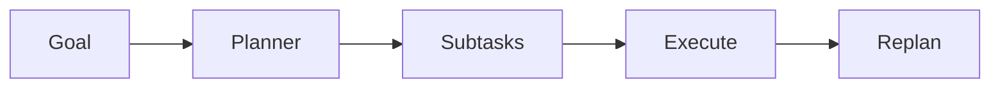
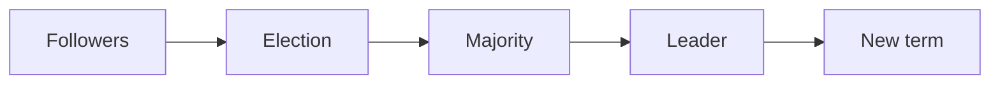

# Day 24 — Planning and task decomposition + Consensus and Raft leader election

!!! tip "Daily reps (~60–90 min)"
    Do both cards. Run each DO THIS lab, answer each checkpoint aloud before rereading.

## AI card — Planning and task decomposition

**What to learn, in order:** Use planning only when decomposition improves success, parallelism, or auditability.

**Linear learning path**

1. Plan before execution when tasks are coupled
2. Replan from evidence
3. Separate plan from actual state
4. Avoid planning trivial work

!!! example "DO THIS"
    Give an agent a 5-part task and compare plan-first vs direct execution on success and tokens.

!!! question "Mid-senior checkpoint"
    When does planning add hallucinated commitments rather than useful structure?

**Sources**

- Required: [A Practical Guide to Building AI Agents - OpenAI](https://openai.com/business/guides-and-resources/a-practical-guide-to-building-ai-agents/) — Production-oriented overview of when to use agents, how to orchestrate them, and how to apply safeguards.
- Official / deep: [Building Effective Agents - Anthropic](https://www.anthropic.com/engineering/building-effective-agents) — Defines workflows versus agents and argues for simple composable patterns before complex frameworks.

---

## System Design card — Consensus and Raft leader election

**What to learn, in order:** Understand why distributed replicas need an agreed authority before committing one history.

**Linear learning path**

1. Terms
2. Follower/candidate/leader
3. Majority election
4. Split-vote retry

!!! example "DO THIS"
    Run the Raft visualization or implement a tiny election simulator.

!!! question "Mid-senior checkpoint"
    Why can two nodes believe they are leaders at different times without violating safety?

**Sources**

- Required: [Raft: Understandable Consensus](https://raft.github.io/raft.pdf) — Explains leader election, replicated logs, commitment, terms, and consensus safety.
- Official / deep: [Raft Home and Visualization](https://raft.github.io/) — Companion material, visualizations, and implementations for the Raft paper.

---
*Source: `60_Days_AI_Engineering_System_Design_Roadmap_Anup_Dangi.pdf`, Day 24 cards. [Suggest a correction](https://github.com/AnupDangi/learnlikeadev/issues/new)*
