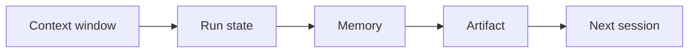
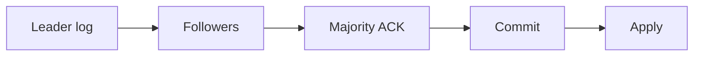

# Day 25 — Context, state, memory, artifact + Raft log replication and commit

!!! tip "Daily reps (~60–90 min)"
    Do both cards. Run each DO THIS lab, answer each checkpoint aloud before rereading.

## AI card — Context, state, memory, artifact

**What to learn, in order:** Stop treating chat history as a universal persistence layer.

**Linear learning path**

1. Context: what model sees now
2. State: machine-readable run position
3. Memory: reusable future guidance
4. Artifact: reviewed source of truth

!!! example "DO THIS"
    Refactor one agent so durable task state is stored separately from conversation messages.

!!! question "Mid-senior checkpoint"
    Which facts must survive even if every model message is deleted?

**Sources**

- Required: [Effective Context Engineering for AI Agents - Anthropic](https://www.anthropic.com/engineering/effective-context-engineering-for-ai-agents) — Explains compaction, structured note-taking, and context curation for long-horizon agents.
- Official / deep: [Building Reliable Agents with Memory and Compaction - OpenAI](https://developers.openai.com/cookbook/examples/agents_sdk/building_reliable_agents_memory_compaction) — Separates active-run compaction, reusable memory, and the reviewed artifact as distinct responsibilities.

---

## System Design card — Raft log replication and commit

**What to learn, in order:** Follow one write from leader append through follower replication to majority commitment.

**Linear learning path**

1. Log index/term
2. AppendEntries
3. Majority acknowledgement
4. Commit index and application

!!! example "DO THIS"
    Simulate one leader failure before and after majority replication.

!!! question "Mid-senior checkpoint"
    Why is "written on the leader" different from "committed"?

**Sources**

- Required: [Raft: Understandable Consensus](https://raft.github.io/raft.pdf) — Explains leader election, replicated logs, commitment, terms, and consensus safety.
- Official / deep: [Raft Home](https://raft.github.io/) — Visual and implementation resources that make election/log behavior easier to inspect.

---
*Source: `60_Days_AI_Engineering_System_Design_Roadmap_Anup_Dangi.pdf`, Day 25 cards. [Suggest a correction](https://github.com/AnupDangi/learnlikeadev/issues/new)*
