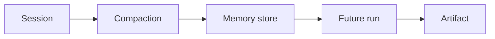
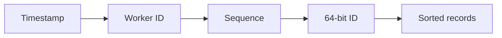

# Day 26 — Agent memory architecture + Distributed unique IDs

!!! tip "Daily reps (~60–90 min)"
    Do both cards. Run each DO THIS lab, answer each checkpoint aloud before rereading.

## AI card — Agent memory architecture

**What to learn, in order:** Design memory around reusable behavior and preferences, not indiscriminate storage of every conversation.

**Linear learning path**

1. Short-term session context
2. Compaction
3. Long-term memory
4. Provenance and deletion boundaries

!!! example "DO THIS"
    Add explicit memory write/read rules to an agent and test whether irrelevant memories pollute later runs.

!!! question "Mid-senior checkpoint"
    What deserves long-term memory, and what should remain only in the reviewed artifact?

**Sources**

- Required: [Building Reliable Agents with Memory and Compaction - OpenAI](https://developers.openai.com/cookbook/examples/agents_sdk/building_reliable_agents_memory_compaction) — Separates active-run compaction, reusable memory, and the reviewed artifact as distinct responsibilities.
- Official / deep: [Effective Context Engineering for AI Agents - Anthropic](https://www.anthropic.com/engineering/effective-context-engineering-for-ai-agents) — Explains compaction, structured note-taking, and context curation for long-horizon agents.

---

## System Design card — Distributed unique IDs

**What to learn, in order:** Generate IDs without a single database sequence becoming a global bottleneck.

**Linear learning path**

1. Timestamp bits
2. Worker/machine identifier
3. Per-time-unit sequence
4. Clock rollback risk

!!! example "DO THIS"
    Implement a Snowflake-style 64-bit ID generator and decode generated IDs.

!!! question "Mid-senior checkpoint"
    What happens if two workers accidentally share the same worker ID?

**Sources**

- Required: [Twitter Snowflake](https://github.com/twitter-archive/snowflake) — Reference design for generating sortable globally unique IDs without a single database sequence.
- Official / deep: [Time, Clocks, and the Ordering of Events - Lamport](https://lamport.azurewebsites.net/pubs/time-clocks.pdf) — Foundational paper for reasoning about event ordering and causality without relying on synchronized wall clocks.

---
*Source: `60_Days_AI_Engineering_System_Design_Roadmap_Anup_Dangi.pdf`, Day 26 cards. [Suggest a correction](https://github.com/AnupDangi/learnlikeadev/issues/new)*
