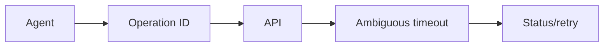

# Day 27 — Reliable tool execution and idempotency + Queues and asynchronous processing

!!! tip "Daily reps (~60–90 min)"
    Do both cards. Run each DO THIS lab, answer each checkpoint aloud before rereading.

## AI card — Reliable tool execution and idempotency

**What to learn, in order:** A timeout is ambiguous: the side effect may have happened even if the agent never received the response.

**Linear learning path**

1. Operation IDs
2. Idempotency keys
3. Status lookup
4. Retry only when semantics are known

!!! example "DO THIS"
    Wrap one side-effecting tool with operation_id and make repeated retries produce one business effect.

!!! question "Mid-senior checkpoint"
    How should an agent recover when an API times out after committing the operation?

**Sources**

- Required: [Writing Effective Tools for Agents - Anthropic](https://www.anthropic.com/engineering/writing-tools-for-agents) — Shows how tool naming, boundaries, output design, and evals affect agent performance.
- Official / deep: [Timeouts, Retries and Backoff with Jitter - AWS Builders Library](https://aws.amazon.com/builders-library/timeouts-retries-and-backoff-with-jitter/) — Canonical reliability guidance for safe retry policies, bounded attempts, exponential backoff, and jitter.

---

## System Design card — Queues and asynchronous processing

**What to learn, in order:** Use queues to decouple arrival time from processing time while remembering that buffering is not capacity.

**Linear learning path**

1. Producer/consumer decoupling
2. Queue depth
3. Service rate vs arrival rate
4. Visibility/acknowledgement

!!! example "DO THIS"
    Build a worker queue and deliberately make producers 2x faster than consumers.

!!! question "Mid-senior checkpoint"
    When does a queue make an outage worse by preserving too much stale work?

**Sources**

- Required: [Avoiding Insurmountable Queue Backlogs - AWS Builders Library](https://aws.amazon.com/builders-library/avoiding-insurmountable-queue-backlogs/) — Explains backlog growth, capacity mismatch, stale work, and why queues do not create processing capacity.
- Official / deep: [Timeouts, Retries and Backoff with Jitter - AWS Builders Library](https://aws.amazon.com/builders-library/timeouts-retries-and-backoff-with-jitter/) — Canonical reliability guidance for retries, timeouts, exponential backoff, jitter, and amplification control.

---
*Source: `60_Days_AI_Engineering_System_Design_Roadmap_Anup_Dangi.pdf`, Day 27 cards. [Suggest a correction](https://github.com/AnupDangi/learnlikeadev/issues/new)*
