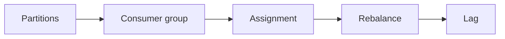

# Day 29 — Durable and resumable agent execution + Kafka consumer groups and rebalancing

!!! tip "Daily reps (~60–90 min)"
    Do both cards. Run each DO THIS lab, answer each checkpoint aloud before rereading.

## AI card — Durable and resumable agent execution

**What to learn, in order:** Long-running work must survive context limits, process crashes, and human pauses.

**Linear learning path**

1. Checkpoint explicit progress
2. Persist artifacts and task ledger
3. Resume from durable state
4. Verify before declaring completion

!!! example "DO THIS"
    Kill an agent process halfway through a 10-step task and resume from stored state without repeating side effects.

!!! question "Mid-senior checkpoint"
    What is the minimal state required to resume safely?

**Sources**

- Required: [Effective Harnesses for Long-running Agents - Anthropic](https://www.anthropic.com/engineering/effective-harnesses-for-long-running-agents) — Shows how agents preserve progress across context windows using explicit artifacts and incremental work.
- Official / deep: [Background Mode - OpenAI](https://developers.openai.com/api/docs/guides/background) — Shows how to model long-running AI work as asynchronous jobs rather than fragile client connections.

---

## System Design card — Kafka consumer groups and rebalancing

**What to learn, in order:** Understand how partitions are assigned to workers and what happens when fleet membership changes.

**Linear learning path**

1. One partition per active consumer within a group
2. Rebalance on membership change
3. Offset commits
4. Slow consumer effects

!!! example "DO THIS"
    Start/stop consumers and observe partition reassignment and lag.

!!! question "Mid-senior checkpoint"
    Why does adding consumers beyond partition count stop increasing parallelism?

**Sources**

- Required: [Apache Kafka Documentation](https://kafka.apache.org/documentation/) — Operational reference for consumer groups, producers, brokers, configuration, and ecosystem behavior.
- Official / deep: [Apache Kafka Design](https://kafka.apache.org/design/) — Official explanation of partitions, persistence, batching, consumer offsets, replication, and delivery guarantees.

---
*Source: `60_Days_AI_Engineering_System_Design_Roadmap_Anup_Dangi.pdf`, Day 29 cards. [Suggest a correction](https://github.com/AnupDangi/learnlikeadev/issues/new)*
