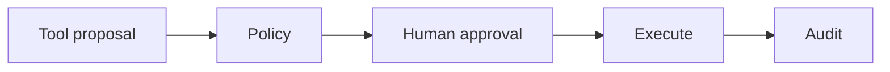
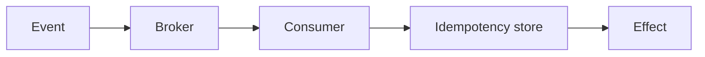

# Day 30 — Guardrails, permissions, and human approval + Delivery semantics and idempotent consumers

!!! tip "Daily reps (~60–90 min)"
    Do both cards. Run each DO THIS lab, answer each checkpoint aloud before rereading.

## AI card — Guardrails, permissions, and human approval

**What to learn, in order:** Separate automated policy checks from explicit approval for high-risk or irreversible actions.

**Linear learning path**

1. Risk classification
2. Automatic guardrail
3. Human gate
4. Resume same durable run

!!! example "DO THIS"
    Assign risk/reversibility metadata to 10 tools and implement a simple approval policy engine.

!!! question "Mid-senior checkpoint"
    Which actions should remain impossible even after a user clicks Approve?

**Sources**

- Required: [Guardrails and Human Approvals - OpenAI](https://developers.openai.com/api/docs/guides/agents/guardrails-approvals) — Covers automated safety checks and explicit human approval for sensitive tool actions.
- Official / deep: [How We Contain Claude Across Products - Anthropic](https://www.anthropic.com/engineering/how-we-contain-claude) — Production lessons on sandboxing, scoped credentials, network boundaries, and limiting agent blast radius.

---

## System Design card — Delivery semantics and idempotent consumers

**What to learn, in order:** Retries make duplicates normal; business effects must tolerate redelivery.

**Linear learning path**

1. At-most-once
2. At-least-once
3. Duplicate delivery
4. Idempotent consumer state

!!! example "DO THIS"
    Process the same event twice and design a deduplication or idempotency key strategy.

!!! question "Mid-senior checkpoint"
    What exactly does "exactly once" mean at the boundary of an external side effect?

**Sources**

- Required: [Apache Kafka Design](https://kafka.apache.org/design/) — Official explanation of partitions, persistence, batching, consumer offsets, replication, and delivery guarantees.
- Official / deep: [Idempotent Requests - Stripe](https://docs.stripe.com/api/idempotent_requests) — A concrete API-side example of turning duplicate retries into one logical effect.

---
*Source: `60_Days_AI_Engineering_System_Design_Roadmap_Anup_Dangi.pdf`, Day 30 cards. [Suggest a correction](https://github.com/AnupDangi/learnlikeadev/issues/new)*
