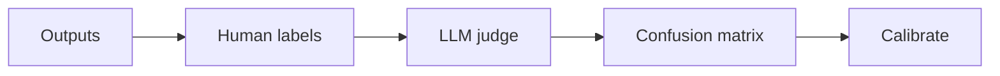
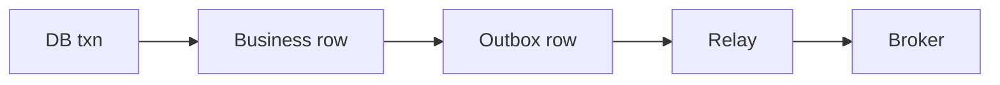

# Day 32 — LLM-as-judge calibration + Transactional outbox

!!! tip "Daily reps (~60–90 min)"
    Do both cards. Run each DO THIS lab, answer each checkpoint aloud before rereading.

## AI card — LLM-as-judge calibration

**What to learn, in order:** Automated judges are useful only after proving they approximate the human criterion you care about.

**Linear learning path**

1. Human-labeled calibration set
2. Precision/recall
3. Judge bias
4. Disagreement review

!!! example "DO THIS"
    Label 50 outputs manually, run an LLM judge, and calculate a confusion matrix.

!!! question "Mid-senior checkpoint"
    Can a judge with 95% accuracy still be unsafe for your release gate?

**Sources**

- Required: [Putting Evals Into Production - Hamel Husain](https://hamel.dev/notes/llm/ai-product-engineering/evals-production.html) — Shows how human labels, evaluator validation, and production samples become a continuous quality loop.
- Official / deep: [Demystifying Evals for AI Agents - Anthropic](https://www.anthropic.com/engineering/demystifying-evals-for-ai-agents) — Explains why multi-turn tool-using agents require richer evals than single-response models.

---

## System Design card — Transactional outbox

**What to learn, in order:** Avoid unsafe dual writes when one business operation must update a DB and publish an event.

**Linear learning path**

1. Business row + outbox row in one transaction
2. Relay/CDC publishes later
3. Idempotent publication
4. Consumer deduplication

!!! example "DO THIS"
    Implement orders + outbox table and a relay that publishes unsent rows.

!!! question "Mid-senior checkpoint"
    What happens if the relay publishes successfully and crashes before marking the row sent?

**Sources**

- Required: [Transactional Outbox Pattern - microservices.io](https://microservices.io/patterns/data/transactional-outbox.html) — Explains how to atomically persist business changes and outgoing events without unsafe dual writes.
- Official / deep: [Debezium Documentation](https://debezium.io/documentation/reference/stable/) — Official CDC reference for streaming database changes into event systems.

---
*Source: `60_Days_AI_Engineering_System_Design_Roadmap_Anup_Dangi.pdf`, Day 32 cards. [Suggest a correction](https://github.com/AnupDangi/learnlikeadev/issues/new)*
