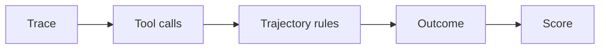
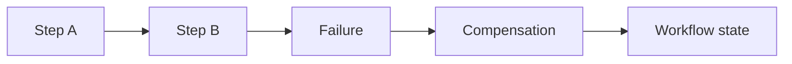

# Day 33 — Trajectory and tool-call evals + Saga pattern and compensating actions

!!! tip "Daily reps (~60–90 min)"
    Do both cards. Run each DO THIS lab, answer each checkpoint aloud before rereading.

## AI card — Trajectory and tool-call evals

**What to learn, in order:** For agents, the path matters: an apparently correct answer may hide unsafe or wasteful actions.

**Linear learning path**

1. Outcome metrics
2. Tool-selection correctness
3. Unnecessary steps
4. Handoff/trajectory checks

!!! example "DO THIS"
    Add assertions for forbidden tools, maximum steps, and required evidence to an agent eval.

!!! question "Mid-senior checkpoint"
    When should a correct final answer still fail the eval?

**Sources**

- Required: [Agent Evals - OpenAI](https://developers.openai.com/api/docs/guides/agent-evals) — Reference for evaluating agent outcomes, trajectories, tools, and workflow behavior.
- Official / deep: [Agent Tracing - OpenAI](https://developers.openai.com/api/docs/guides/agents-api/tracing) — Shows how to inspect agent runs as traces composed of model, tool, and orchestration spans.

---

## System Design card — Saga pattern and compensating actions

**What to learn, in order:** Coordinate multi-service workflows without pretending one global ACID transaction exists.

**Linear learning path**

1. Local transactions
2. Workflow state
3. Compensation
4. Irreversible step handling

!!! example "DO THIS"
    Model order->payment->inventory->shipping with compensations for failures at each stage.

!!! question "Mid-senior checkpoint"
    Which actions cannot truly be "rolled back" and how does the design account for them?

**Sources**

- Required: [Saga Distributed Transactions - Azure Architecture Center](https://learn.microsoft.com/en-us/azure/architecture/reference-architectures/saga/saga) — Shows how long-running multi-service workflows use local transactions and compensating actions.
- Official / deep: [Transactional Outbox Pattern - microservices.io](https://microservices.io/patterns/data/transactional-outbox.html) — Explains how to atomically persist business changes and outgoing events without unsafe dual writes.

---
*Source: `60_Days_AI_Engineering_System_Design_Roadmap_Anup_Dangi.pdf`, Day 33 cards. [Suggest a correction](https://github.com/AnupDangi/learnlikeadev/issues/new)*
