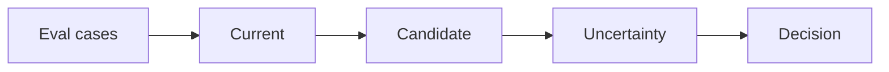
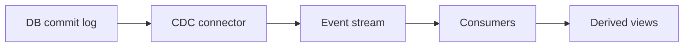

# Day 34 — Statistical evals and confidence + Change Data Capture

!!! tip "Daily reps (~60–90 min)"
    Do both cards. Run each DO THIS lab, answer each checkpoint aloud before rereading.

## AI card — Statistical evals and confidence

**What to learn, in order:** Small score changes are meaningless without understanding sample size, variance, and paired comparisons.

**Linear learning path**

1. Paired evals
2. Confidence intervals intuition
3. Failure severity
4. Avoid repeated test-set tuning

!!! example "DO THIS"
    Bootstrap the difference between two candidates on a fixed eval set.

!!! question "Mid-senior checkpoint"
    Would you ship a +1% average gain if the candidate regresses a critical slice?

**Sources**

- Required: [Demystifying Evals for AI Agents - Anthropic](https://www.anthropic.com/engineering/demystifying-evals-for-ai-agents) — Explains why multi-turn tool-using agents require richer evals than single-response models.
- Official / deep: [AI Product Engineering Notes - Hamel Husain](https://hamel.dev/notes/llm/ai-product-engineering/) — Practical guidance on error analysis, eval design, human review, and building AI products around real failures.

---

## System Design card — Change Data Capture

**What to learn, in order:** Turn committed database changes into an event stream without forcing every service to dual-write events manually.

**Linear learning path**

1. Read transaction log
2. Emit ordered change events
3. Schema evolution
4. Replay and downstream lag

!!! example "DO THIS"
    Run Debezium against a local DB and observe inserts/updates as events.

!!! question "Mid-senior checkpoint"
    What consistency assumptions can consumers make about CDC ordering across tables?

**Sources**

- Required: [Debezium Documentation](https://debezium.io/documentation/reference/stable/) — Official CDC reference for streaming database changes into event systems.
- Official / deep: [Transactional Outbox Pattern - microservices.io](https://microservices.io/patterns/data/transactional-outbox.html) — Explains how to atomically persist business changes and outgoing events without unsafe dual writes.

---
*Source: `60_Days_AI_Engineering_System_Design_Roadmap_Anup_Dangi.pdf`, Day 34 cards. [Suggest a correction](https://github.com/AnupDangi/learnlikeadev/issues/new)*
