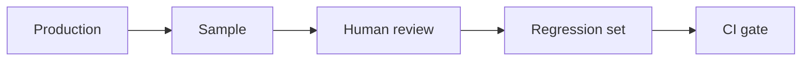
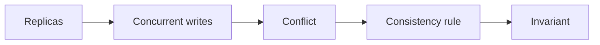

# Day 35 — Continuous production eval flywheel + Strong vs eventual consistency

!!! tip "Daily reps (~60–90 min)"
    Do both cards. Run each DO THIS lab, answer each checkpoint aloud before rereading.

## AI card — Continuous production eval flywheel

**What to learn, in order:** Production failures should become reusable regression cases instead of one-off prompt tweaks.

**Linear learning path**

1. Sample live traces
2. Human review
3. Convert failures into eval cases
4. Gate future changes

!!! example "DO THIS"
    Pick 10 real/representative traces, label failure causes, and add them to CI evals.

!!! question "Mid-senior checkpoint"
    How do you prevent the eval set from becoming a pile of obsolete edge cases?

**Sources**

- Required: [Putting Evals Into Production - Hamel Husain](https://hamel.dev/notes/llm/ai-product-engineering/evals-production.html) — Shows how human labels, evaluator validation, and production samples become a continuous quality loop.
- Official / deep: [Build an Agent Improvement Loop - OpenAI](https://developers.openai.com/cookbook/examples/agents_sdk/agent_improvement_loop) — Connects real traces, human/model feedback, reusable evals, and reviewed harness changes into an improvement flywheel.

---

## System Design card — Strong vs eventual consistency

**What to learn, in order:** Choose semantics per invariant rather than labeling an entire product "strong" or "eventual".

**Linear learning path**

1. Stale reads
2. Concurrent writes
3. Authoritative owner
4. Invariant-driven coordination

!!! example "DO THIS"
    Classify presence, payments, likes, inventory, and collaborative edits by consistency needs.

!!! question "Mid-senior checkpoint"
    Which business invariant forces coordination during a network partition?

**Sources**

- Required: [Research for Practice: Convergence - Kleppmann & Alvaro](https://queue.acm.org/detail.cfm?id=3561801) — Explores consensus versus convergence, coordination costs, and eventually consistent replicated data.
- Official / deep: [Dynamo: Amazon Highly Available Key-value Store](https://www.allthingsdistributed.com/files/amazon-dynamo-sosp2007.pdf) — Classic system covering consistent hashing, quorums, eventual consistency, vector clocks, and always-on availability.

---
*Source: `60_Days_AI_Engineering_System_Design_Roadmap_Anup_Dangi.pdf`, Day 35 cards. [Suggest a correction](https://github.com/AnupDangi/learnlikeadev/issues/new)*
