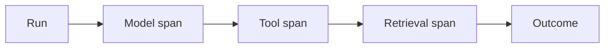
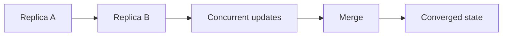

# Day 36 — AI tracing and run observability + Convergence and CRDT intuition

!!! tip "Daily reps (~60–90 min)"
    Do both cards. Run each DO THIS lab, answer each checkpoint aloud before rereading.

## AI card — AI tracing and run observability

**What to learn, in order:** Trace the complete run so failures can be attributed to model calls, retrieval, tools, routing, or external dependencies.

**Linear learning path**

1. Trace/run/span hierarchy
2. Record model/tool timings
3. Capture errors and retries
4. Keep sensitive data policies explicit

!!! example "DO THIS"
    Instrument one agent run and create a trace waterfall with model and tool spans.

!!! question "Mid-senior checkpoint"
    What production question can your logs answer that your traces cannot?

**Sources**

- Required: [Agent Tracing - OpenAI](https://developers.openai.com/api/docs/guides/agents-api/tracing) — Shows how to inspect agent runs as traces composed of model, tool, and orchestration spans.
- Official / deep: [OpenTelemetry Documentation](https://opentelemetry.io/docs/) — Vendor-neutral reference for traces, metrics, logs, context propagation, and telemetry pipelines.

---

## System Design card — Convergence and CRDT intuition

**What to learn, in order:** Learn how some replicated data types can accept concurrent updates and deterministically merge later.

**Linear learning path**

1. Convergence vs coordination
2. Merge semantics
3. Commutative/idempotent updates
4. Invariant limitations

!!! example "DO THIS"
    Implement a G-Counter on two replicas and merge updates in different orders.

!!! question "Mid-senior checkpoint"
    Why does replica convergence not imply that an inventory invariant was preserved?

**Sources**

- Required: [Research for Practice: Convergence - Kleppmann & Alvaro](https://queue.acm.org/detail.cfm?id=3561801) — Explores consensus versus convergence, coordination costs, and eventually consistent replicated data.
- Official / deep: [Dynamo: Amazon Highly Available Key-value Store](https://www.allthingsdistributed.com/files/amazon-dynamo-sosp2007.pdf) — Classic system covering consistent hashing, quorums, eventual consistency, vector clocks, and always-on availability.

---
*Source: `60_Days_AI_Engineering_System_Design_Roadmap_Anup_Dangi.pdf`, Day 36 cards. [Suggest a correction](https://github.com/AnupDangi/learnlikeadev/issues/new)*
