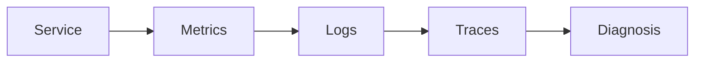

# Day 37 — Cost per successful task + Metrics, logs, and distributed traces

!!! tip "Daily reps (~60–90 min)"
    Do both cards. Run each DO THIS lab, answer each checkpoint aloud before rereading.

## AI card — Cost per successful task

**What to learn, in order:** Optimize the cost of achieving a correct user outcome, not just cost per API call.

**Linear learning path**

1. Token/request accounting
2. Model/tool call count
3. Failure/retry cost
4. Cost per successful task

!!! example "DO THIS"
    Add a per-run budget counter and stop/degrade when expected next-step cost exceeds remaining budget.

!!! question "Mid-senior checkpoint"
    When can a more expensive model reduce total cost by avoiding retries or tool mistakes?

**Sources**

- Required: [Cost Optimization - OpenAI](https://developers.openai.com/api/docs/guides/cost-optimization) — Explains reducing requests, tokens, model size, and using batch/flex processing for lower cost.
- Official / deep: [API Deployment Checklist - OpenAI](https://developers.openai.com/api/docs/guides/deployment-checklist) — Current deployment checklist spanning model choice, reasoning budgets, tools, compaction, caching, and reliability.

---

## System Design card — Metrics, logs, and distributed traces

**What to learn, in order:** Know which telemetry answers aggregate health, event detail, and request-path questions.

**Linear learning path**

1. Metrics for trends/alerts
2. Logs for event detail
3. Traces for causal request paths
4. Correlation IDs/context propagation

!!! example "DO THIS"
    Instrument one endpoint with all three signal types and debug one synthetic failure.

!!! question "Mid-senior checkpoint"
    Which signal would you query first for a p99 latency regression?

**Sources**

- Required: [Monitoring Distributed Systems - Google SRE](https://sre.google/sre-book/monitoring-distributed-systems/) — Introduces latency, traffic, errors, saturation, and symptom-oriented monitoring.
- Official / deep: [OpenTelemetry Traces](https://opentelemetry.io/docs/concepts/signals/traces/) — Official trace model: spans, trace context, parent-child relationships, and propagation.

---
*Source: `60_Days_AI_Engineering_System_Design_Roadmap_Anup_Dangi.pdf`, Day 37 cards. [Suggest a correction](https://github.com/AnupDangi/learnlikeadev/issues/new)*
