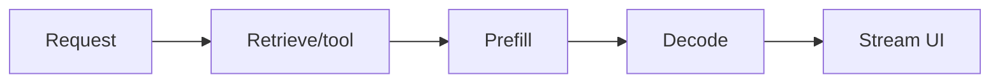
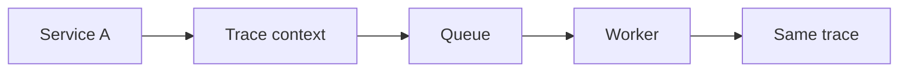

# Day 38 — Latency breakdown: TTFT, token speed, tools + OpenTelemetry and context propagation

!!! tip "Daily reps (~60–90 min)"
    Do both cards. Run each DO THIS lab, answer each checkpoint aloud before rereading.

## AI card — Latency breakdown: TTFT, token speed, tools

**What to learn, in order:** Treat end-to-end latency as a critical path rather than blaming the model for every slow response.

**Linear learning path**

1. Network/queue
2. Prefill/TTFT
3. Decode/TPOT
4. Sequential vs parallel tools

!!! example "DO THIS"
    Instrument a request and produce a millisecond waterfall for every major stage.

!!! question "Mid-senior checkpoint"
    Which optimization changes user-perceived latency without changing total compute time?

**Sources**

- Required: [Latency Optimization - OpenAI](https://developers.openai.com/api/docs/guides/latency-optimization) — Explains how model choice, token count, request count, parallelism, and UI design affect end-to-end latency.
- Official / deep: [Production Best Practices - OpenAI](https://developers.openai.com/api/docs/guides/production-best-practices) — Production checklist for reliability, latency, usage limits, and operational safeguards.

---

## System Design card — OpenTelemetry and context propagation

**What to learn, in order:** Standardize trace/span context across services so one request stays correlated through process boundaries.

**Linear learning path**

1. Trace ID
2. Span ID
3. Parent-child relations
4. Propagation through HTTP/queues

!!! example "DO THIS"
    Propagate a trace context from HTTP request to background worker.

!!! question "Mid-senior checkpoint"
    What breaks in incident debugging when async jobs create unrelated traces?

**Sources**

- Required: [OpenTelemetry Traces](https://opentelemetry.io/docs/concepts/signals/traces/) — Official trace model: spans, trace context, parent-child relationships, and propagation.
- Official / deep: [Dapper: Large-Scale Distributed Tracing Infrastructure - Google](https://research.google/pubs/dapper-a-large-scale-distributed-systems-tracing-infrastructure/) — Foundational tracing paper for reconstructing one request across many distributed services.

---
*Source: `60_Days_AI_Engineering_System_Design_Roadmap_Anup_Dangi.pdf`, Day 38 cards. [Suggest a correction](https://github.com/AnupDangi/learnlikeadev/issues/new)*
