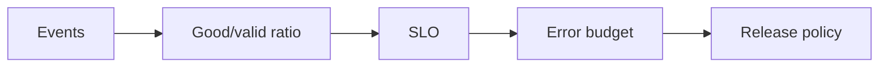

# Day 39 — AI SLOs and service-quality metrics + SLIs, SLOs, and error budgets

!!! tip "Daily reps (~60–90 min)"
    Do both cards. Run each DO THIS lab, answer each checkpoint aloud before rereading.

## AI card — AI SLOs and service-quality metrics

**What to learn, in order:** Define reliability around user-visible AI outcomes rather than only provider uptime.

**Linear learning path**

1. Availability of usable answers
2. Latency SLO
3. Quality/task-success metric
4. Cost/abuse operational limits

!!! example "DO THIS"
    Write an SLO for one AI endpoint including success, latency, and degraded-mode behavior.

!!! question "Mid-senior checkpoint"
    Can an API be 99.99% available while the AI product is effectively broken?

**Sources**

- Required: [Production Best Practices - OpenAI](https://developers.openai.com/api/docs/guides/production-best-practices) — Production checklist for reliability, latency, usage limits, and operational safeguards.
- Official / deep: [API Deployment Checklist - OpenAI](https://developers.openai.com/api/docs/guides/deployment-checklist) — Current deployment checklist spanning model choice, reasoning budgets, tools, compaction, caching, and reliability.

---

## System Design card — SLIs, SLOs, and error budgets

**What to learn, in order:** Turn reliability into explicit objectives and a budget for failure/change.

**Linear learning path**

1. Choose user-journey SLI
2. Set target SLO
3. Calculate error budget
4. Use budget to govern release pace

!!! example "DO THIS"
    Compute monthly downtime/error budget for 99.9% and 99.99% services.

!!! question "Mid-senior checkpoint"
    Which SLI most closely matches what users actually experience?

**Sources**

- Required: [Alerting on SLOs - Google SRE Workbook](https://sre.google/workbook/alerting-on-slos/) — Shows how error budgets and multi-window burn-rate alerts create actionable reliability paging.
- Official / deep: [Monitoring Distributed Systems - Google SRE](https://sre.google/sre-book/monitoring-distributed-systems/) — Introduces latency, traffic, errors, saturation, and symptom-oriented monitoring.

---
*Source: `60_Days_AI_Engineering_System_Design_Roadmap_Anup_Dangi.pdf`, Day 39 cards. [Suggest a correction](https://github.com/AnupDangi/learnlikeadev/issues/new)*
