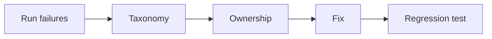

# Day 40 — AI reliability budgets and failure taxonomy + Burn-rate alerting

!!! tip "Daily reps (~60–90 min)"
    Do both cards. Run each DO THIS lab, answer each checkpoint aloud before rereading.

## AI card — AI reliability budgets and failure taxonomy

**What to learn, in order:** Classify failures so the team knows whether to change prompt, retrieval, model, tool, infra, or product semantics.

**Linear learning path**

1. Model failure
2. Retrieval failure
3. Tool/dependency failure
4. Policy/product ambiguity

!!! example "DO THIS"
    Label 50 failures by root-cause family and count where engineering effort should go.

!!! question "Mid-senior checkpoint"
    Which failure classes are detectable automatically versus only through expert review?

**Sources**

- Required: [Common Pitfalls When Building Generative AI Applications - Chip Huyen](https://huyenchip.com/2025/01/16/ai-engineering-pitfalls.html) — Production lessons on premature complexity, evaluation, human review, and long-tail failures.
- Official / deep: [AI Product Engineering Notes - Hamel Husain](https://hamel.dev/notes/llm/ai-product-engineering/) — Practical guidance on error analysis, eval design, human review, and building AI products around real failures.

---

## System Design card — Burn-rate alerting

**What to learn, in order:** Page on how quickly reliability budget is being consumed, not arbitrary one-off thresholds.

**Linear learning path**

1. Error-budget burn rate
2. Fast vs slow windows
3. Multi-window alerting
4. Avoid noisy paging

!!! example "DO THIS"
    For a 99.9% SLO, calculate burn rate under 1%, 5%, and 20% error rates.

!!! question "Mid-senior checkpoint"
    Why is a short 10x burn spike different from a 2x burn sustained for hours?

**Sources**

- Required: [Alerting on SLOs - Google SRE Workbook](https://sre.google/workbook/alerting-on-slos/) — Shows how error budgets and multi-window burn-rate alerts create actionable reliability paging.
- Official / deep: [Monitoring Distributed Systems - Google SRE](https://sre.google/sre-book/monitoring-distributed-systems/) — Introduces latency, traffic, errors, saturation, and symptom-oriented monitoring.

---
*Source: `60_Days_AI_Engineering_System_Design_Roadmap_Anup_Dangi.pdf`, Day 40 cards. [Suggest a correction](https://github.com/AnupDangi/learnlikeadev/issues/new)*
