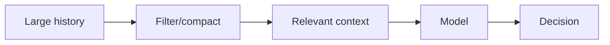
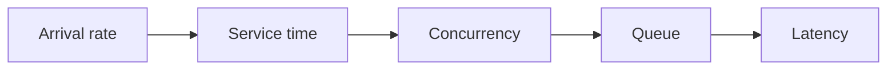

# Day 41 — Context engineering and context budgets + Little's Law and queueing intuition

!!! tip "Daily reps (~60–90 min)"
    Do both cards. Run each DO THIS lab, answer each checkpoint aloud before rereading.

## AI card — Context engineering and context budgets

**What to learn, in order:** Select the minimum useful evidence for the next decision rather than filling the context window because space exists.

**Linear learning path**

1. Context relevance
2. Tool-output pruning
3. Compaction
4. External artifacts instead of transcript replay

!!! example "DO THIS"
    Measure one agent task with full history vs curated context and compare tokens and success.

!!! question "Mid-senior checkpoint"
    What information is useful to store but harmful to keep in active context?

**Sources**

- Required: [Effective Context Engineering for AI Agents - Anthropic](https://www.anthropic.com/engineering/effective-context-engineering-for-ai-agents) — Explains compaction, structured note-taking, and context curation for long-horizon agents.
- Official / deep: [Building Reliable Agents with Memory and Compaction - OpenAI](https://developers.openai.com/cookbook/examples/agents_sdk/building_reliable_agents_memory_compaction) — Separates active-run compaction, reusable memory, and the reviewed artifact as distinct responsibilities.

---

## System Design card — Little's Law and queueing intuition

**What to learn, in order:** Connect arrival rate, work duration, and concurrency so capacity reasoning becomes quantitative.

**Linear learning path**

1. L = lambda W
2. Concurrency grows with service time
3. Saturation creates queues
4. Latency feedback loops

!!! example "DO THIS"
    Calculate concurrency for 100 req/s at 50ms, 500ms, and 5s service times.

!!! question "Mid-senior checkpoint"
    Why can latency increase cause overload even when incoming traffic is unchanged?

**Sources**

- Required: [Avoiding Insurmountable Queue Backlogs - AWS Builders Library](https://aws.amazon.com/builders-library/avoiding-insurmountable-queue-backlogs/) — Explains backlog growth, capacity mismatch, stale work, and why queues do not create processing capacity.
- Official / deep: [Scaling Your API with Rate Limiters - Stripe](https://stripe.com/blog/rate-limiters) — Production design for request rate limits, concurrency limits, fleet protection, and worker-utilization controls.

---
*Source: `60_Days_AI_Engineering_System_Design_Roadmap_Anup_Dangi.pdf`, Day 41 cards. [Suggest a correction](https://github.com/AnupDangi/learnlikeadev/issues/new)*
