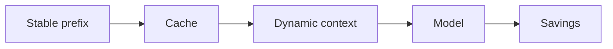
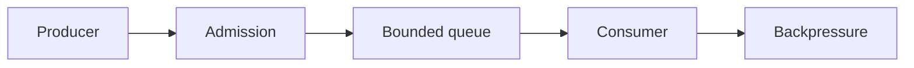

# Day 42 — Prompt and context caching + Backpressure and bounded queues

!!! tip "Daily reps (~60–90 min)"
    Do both cards. Run each DO THIS lab, answer each checkpoint aloud before rereading.

## AI card — Prompt and context caching

**What to learn, in order:** Exploit repeated stable prefixes, tool schemas, and shared instructions without confusing caching with memory.

**Linear learning path**

1. Stable prefix
2. Cache hit/miss
3. Dynamic suffix
4. Cost/latency measurement

!!! example "DO THIS"
    Reorder one prompt so stable content comes first and compare cache hit behavior.

!!! question "Mid-senior checkpoint"
    Which personalization fields accidentally destroy cache reuse?

**Sources**

- Required: [Prompt Caching - OpenAI](https://developers.openai.com/api/docs/guides/prompt-caching) — Explains stable-prefix reuse for lower input cost and lower prefill latency.
- Official / deep: [API Deployment Checklist - OpenAI](https://developers.openai.com/api/docs/guides/deployment-checklist) — Current deployment checklist spanning model choice, reasoning budgets, tools, compaction, caching, and reliability.

---

## System Design card — Backpressure and bounded queues

**What to learn, in order:** Prevent downstream overload by slowing/rejecting upstream work instead of accepting infinite backlog.

**Linear learning path**

1. Bound queue size
2. Reject or shed
3. Producer throttling
4. Age-of-work limits

!!! example "DO THIS"
    Add a bounded queue to a worker system and compare behavior with an unbounded queue during overload.

!!! question "Mid-senior checkpoint"
    When should the producer fail fast instead of enqueueing work?

**Sources**

- Required: [Avoiding Insurmountable Queue Backlogs - AWS Builders Library](https://aws.amazon.com/builders-library/avoiding-insurmountable-queue-backlogs/) — Explains backlog growth, capacity mismatch, stale work, and why queues do not create processing capacity.
- Official / deep: [Addressing Cascading Failures - Google SRE](https://sre.google/sre-book/addressing-cascading-failures/) — Explains overload, retry storms, load shedding, capacity planning, and preventing failure propagation.

---
*Source: `60_Days_AI_Engineering_System_Design_Roadmap_Anup_Dangi.pdf`, Day 42 cards. [Suggest a correction](https://github.com/AnupDangi/learnlikeadev/issues/new)*
