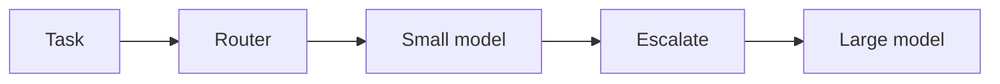
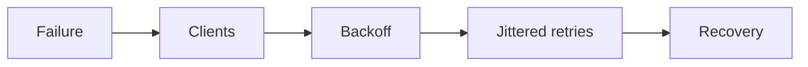

# Day 43 — Model routing and cascades + Retries, exponential backoff, and jitter

!!! tip "Daily reps (~60–90 min)"
    Do both cards. Run each DO THIS lab, answer each checkpoint aloud before rereading.

## AI card — Model routing and cascades

**What to learn, in order:** Use workload-specific routing to balance quality, latency, and cost.

**Linear learning path**

1. Rule-based routing
2. Difficulty/risk classifier
3. Small->large escalation
4. Evaluate routing policy itself

!!! example "DO THIS"
    Create a 2-model cascade and measure fallback rate plus quality/cost.

!!! question "Mid-senior checkpoint"
    What happens when the router is confidently wrong on the hardest tasks?

**Sources**

- Required: [API Deployment Checklist - OpenAI](https://developers.openai.com/api/docs/guides/deployment-checklist) — Current deployment checklist spanning model choice, reasoning budgets, tools, compaction, caching, and reliability.
- Official / deep: [Model Selection Guide - OpenAI](https://developers.openai.com/api/docs/guides/latest-model) — Useful for thinking about workload-model fit rather than defaulting to the largest model.

---

## System Design card — Retries, exponential backoff, and jitter

**What to learn, in order:** Retries are load multipliers; safe systems bound them and decorrelate clients.

**Linear learning path**

1. Transient vs permanent errors
2. Retry budget
3. Exponential backoff
4. Jitter

!!! example "DO THIS"
    Simulate 100 clients retrying together, then add jitter and compare request spikes.

!!! question "Mid-senior checkpoint"
    Where in a multi-layer stack should retries live to avoid multiplication?

**Sources**

- Required: [Timeouts, Retries and Backoff with Jitter - AWS Builders Library](https://aws.amazon.com/builders-library/timeouts-retries-and-backoff-with-jitter/) — Canonical reliability guidance for retries, timeouts, exponential backoff, jitter, and amplification control.
- Official / deep: [Addressing Cascading Failures - Google SRE](https://sre.google/sre-book/addressing-cascading-failures/) — Explains overload, retry storms, load shedding, capacity planning, and preventing failure propagation.

---
*Source: `60_Days_AI_Engineering_System_Design_Roadmap_Anup_Dangi.pdf`, Day 43 cards. [Suggest a correction](https://github.com/AnupDangi/learnlikeadev/issues/new)*
