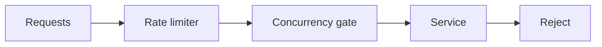

# Day 45 — Long-running and background AI jobs + Rate limits and admission control

!!! tip "Daily reps (~60–90 min)"
    Do both cards. Run each DO THIS lab, answer each checkpoint aloud before rereading.

## AI card — Long-running and background AI jobs

**What to learn, in order:** Model lengthy reasoning as a durable job with status, cancellation, and resumption.

**Linear learning path**

1. Job ID/state machine
2. Client connection independent of job lifetime
3. Polling/subscription
4. Cancellation and expiry

!!! example "DO THIS"
    Build POST /runs returning a job_id and a GET /runs/{id} status endpoint.

!!! question "Mid-senior checkpoint"
    What should happen if the user disconnects after the job has already started?

**Sources**

- Required: [Background Mode - OpenAI](https://developers.openai.com/api/docs/guides/background) — Shows how to model long-running AI work as asynchronous jobs rather than fragile client connections.
- Official / deep: [Effective Harnesses for Long-running Agents - Anthropic](https://www.anthropic.com/engineering/effective-harnesses-for-long-running-agents) — Shows how agents preserve progress across context windows using explicit artifacts and incremental work.

---

## System Design card — Rate limits and admission control

**What to learn, in order:** Protect finite resources before saturation creates queues, timeouts, and retry storms.

**Linear learning path**

1. Request rate vs concurrency
2. Per-user fairness
3. Global capacity protection
4. 429/retry guidance

!!! example "DO THIS"
    Add both token-bucket rate limiting and concurrency limiting to one API.

!!! question "Mid-senior checkpoint"
    Why can request-rate limits fail to protect a service whose requests have highly variable cost?

**Sources**

- Required: [Scaling Your API with Rate Limiters - Stripe](https://stripe.com/blog/rate-limiters) — Production design for request rate limits, concurrency limits, fleet protection, and worker-utilization controls.
- Official / deep: [NGINX Request Limiting](https://nginx.org/en/docs/http/ngx_http_limit_req_module.html) — Implementation-level reference for request-rate control at a proxy layer.

---
*Source: `60_Days_AI_Engineering_System_Design_Roadmap_Anup_Dangi.pdf`, Day 45 cards. [Suggest a correction](https://github.com/AnupDangi/learnlikeadev/issues/new)*
