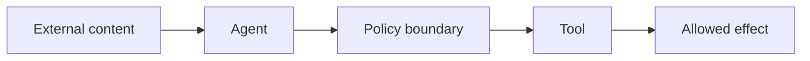
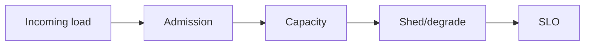

# Day 46 — Prompt injection and untrusted context + Load shedding and overload protection

!!! tip "Daily reps (~60–90 min)"
    Do both cards. Run each DO THIS lab, answer each checkpoint aloud before rereading.

## AI card — Prompt injection and untrusted context

**What to learn, in order:** Treat retrieved text, web pages, tool output, and files as data that may contain adversarial instructions.

**Linear learning path**

1. Instruction/data separation
2. Tool authorization outside model
3. Least privilege
4. Output/evidence validation

!!! example "DO THIS"
    Place a malicious instruction inside a retrieved document and verify the agent cannot exceed its capability policy.

!!! question "Mid-senior checkpoint"
    Which security control still works if the model completely follows the injected instruction?

**Sources**

- Required: [Prompt Injection - OWASP GenAI Security](https://genai.owasp.org/llmrisk/llm01-prompt-injection/) — Threat-model reference for untrusted instructions entering through user content, tools, retrieval, and external sources.
- Official / deep: [How We Contain Claude Across Products - Anthropic](https://www.anthropic.com/engineering/how-we-contain-claude) — Production lessons on sandboxing, scoped credentials, network boundaries, and limiting agent blast radius.

---

## System Design card — Load shedding and overload protection

**What to learn, in order:** Reject low-priority work before the entire system becomes slow and unavailable.

**Linear learning path**

1. Admission before saturation
2. Priority classes
3. Partial/degraded responses
4. Retry amplification

!!! example "DO THIS"
    Generate overload and compare no shedding vs shedding at a fixed concurrency threshold.

!!! question "Mid-senior checkpoint"
    Which requests should be shed first and how do you prevent retry storms?

**Sources**

- Required: [Addressing Cascading Failures - Google SRE](https://sre.google/sre-book/addressing-cascading-failures/) — Explains overload, retry storms, load shedding, capacity planning, and preventing failure propagation.
- Official / deep: [Scaling Your API with Rate Limiters - Stripe](https://stripe.com/blog/rate-limiters) — Production design for request rate limits, concurrency limits, fleet protection, and worker-utilization controls.

---
*Source: `60_Days_AI_Engineering_System_Design_Roadmap_Anup_Dangi.pdf`, Day 46 cards. [Suggest a correction](https://github.com/AnupDangi/learnlikeadev/issues/new)*
