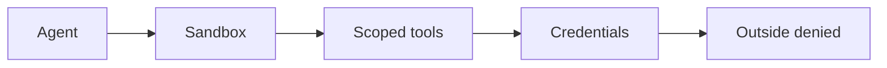
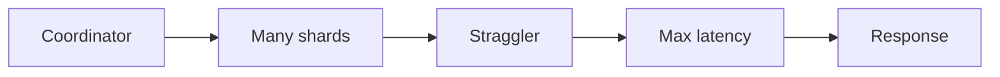

# Day 47 — Sandboxing and least-privilege agents + Tail latency and tail utilization

!!! tip "Daily reps (~60–90 min)"
    Do both cards. Run each DO THIS lab, answer each checkpoint aloud before rereading.

## AI card — Sandboxing and least-privilege agents

**What to learn, in order:** Assume the model can make a bad decision and cap the maximum consequence with deterministic environment boundaries.

**Linear learning path**

1. Workspace isolation
2. Scoped credentials
3. Network egress
4. Human gates for high-risk actions

!!! example "DO THIS"
    Write a capability manifest for a coding agent and test blocked filesystem/network actions.

!!! question "Mid-senior checkpoint"
    What is the maximum damage one compromised agent run can cause?

**Sources**

- Required: [How We Contain Claude Across Products - Anthropic](https://www.anthropic.com/engineering/how-we-contain-claude) — Production lessons on sandboxing, scoped credentials, network boundaries, and limiting agent blast radius.
- Official / deep: [Guardrails and Human Approvals - OpenAI](https://developers.openai.com/api/docs/guides/agents/guardrails-approvals) — Covers automated safety checks and explicit human approval for sensitive tool actions.

---

## System Design card — Tail latency and tail utilization

**What to learn, in order:** At scale, the slowest shard/host often determines the whole request even when averages look healthy.

**Linear learning path**

1. p50 vs p99
2. Fan-out amplification
3. Hedged requests cautiously
4. Tail host saturation

!!! example "DO THIS"
    Simulate a request fan-out to 50 workers with 1% slow responses and measure max latency.

!!! question "Mid-senior checkpoint"
    Why can adding hedged requests make a correlated overload event worse?

**Sources**

- Required: [The Tail at Scale - Dean & Barroso](https://research.google/pubs/the-tail-at-scale/) — Shows how fan-out amplifies stragglers and why p99 latency dominates large distributed requests.
- Official / deep: [Taming Tail Utilization of Ads Inference - Meta](https://engineering.fb.com/2024/07/10/production-engineering/tail-utilization-ads-inference-meta/) — Shows how p95/p99 host utilization, routing, and placement can constrain a fleet even when average load looks safe.

---
*Source: `60_Days_AI_Engineering_System_Design_Roadmap_Anup_Dangi.pdf`, Day 47 cards. [Suggest a correction](https://github.com/AnupDangi/learnlikeadev/issues/new)*
