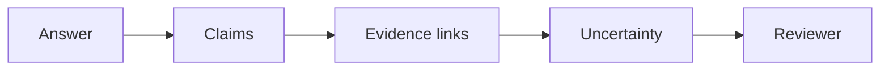
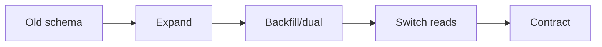

# Day 48 — Verification, provenance, and evidence-bearing AI + Zero-downtime schema evolution

!!! tip "Daily reps (~60–90 min)"
    Do both cards. Run each DO THIS lab, answer each checkpoint aloud before rereading.

## AI card — Verification, provenance, and evidence-bearing AI

**What to learn, in order:** Make AI outputs cheap to verify by surfacing sources, assumptions, unresolved conflicts, and reproducible artifacts.

**Linear learning path**

1. Claim->evidence mapping
2. Provenance
3. Uncertainty
4. Verification time as a product metric

!!! example "DO THIS"
    Redesign one report output so reviewers can verify claims without repeating the research.

!!! question "Mid-senior checkpoint"
    What evidence should be visible immediately versus available through progressive disclosure?

**Sources**

- Required: [AI Product Engineering Notes - Hamel Husain](https://hamel.dev/notes/llm/ai-product-engineering/) — Practical guidance on error analysis, eval design, human review, and building AI products around real failures.
- Official / deep: [Building Reliable Agents with Memory and Compaction - OpenAI](https://developers.openai.com/cookbook/examples/agents_sdk/building_reliable_agents_memory_compaction) — Separates active-run compaction, reusable memory, and the reviewed artifact as distinct responsibilities.

---

## System Design card — Zero-downtime schema evolution

**What to learn, in order:** Change live data structures using compatible intermediate states rather than one irreversible switch.

**Linear learning path**

1. Expand schema
2. Dual read/write or backfill
3. Validate
4. Contract/remove old path

!!! example "DO THIS"
    Plan renaming a heavily used column without downtime or simultaneous client upgrades.

!!! question "Mid-senior checkpoint"
    Can old and new application versions safely coexist throughout the migration?

**Sources**

- Required: [PostgreSQL ALTER TABLE](https://www.postgresql.org/docs/current/sql-altertable.html) — Official schema-change mechanics and locking implications used when planning compatible migrations.
- Official / deep: [Feature Toggles - Martin Fowler](https://martinfowler.com/articles/feature-toggles.html) — Separates code deployment from feature release and explains canary cohorts and flag lifecycles.

---
*Source: `60_Days_AI_Engineering_System_Design_Roadmap_Anup_Dangi.pdf`, Day 48 cards. [Suggest a correction](https://github.com/AnupDangi/learnlikeadev/issues/new)*
