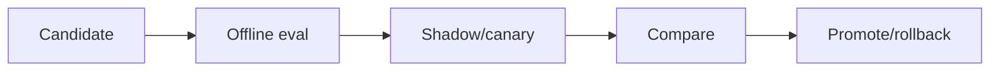
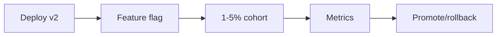

# Day 49 — Offline eval -> shadow -> canary -> rollout + Feature flags, canaries, and rollback

!!! tip "Daily reps (~60–90 min)"
    Do both cards. Run each DO THIS lab, answer each checkpoint aloud before rereading.

## AI card — Offline eval -> shadow -> canary -> rollout

**What to learn, in order:** Reduce AI release risk by promoting a candidate through evidence stages instead of replacing production instantly.

**Linear learning path**

1. Offline regression gate
2. Shadow traffic
3. Stable canary cohort
4. Rollback thresholds

!!! example "DO THIS"
    Define release gates for a model change covering quality, cost, p95 latency, and critical slices.

!!! question "Mid-senior checkpoint"
    When is a higher average eval score still a reason to block release?

**Sources**

- Required: [Putting Evals Into Production - Hamel Husain](https://hamel.dev/notes/llm/ai-product-engineering/evals-production.html) — Shows how human labels, evaluator validation, and production samples become a continuous quality loop.
- Official / deep: [API Deployment Checklist - OpenAI](https://developers.openai.com/api/docs/guides/deployment-checklist) — Current deployment checklist spanning model choice, reasoning budgets, tools, compaction, caching, and reliability.

---

## System Design card — Feature flags, canaries, and rollback

**What to learn, in order:** Separate deployment from release so blast radius can be controlled independently of code shipping.

**Linear learning path**

1. Release flags
2. Stable cohorts
3. Progressive exposure
4. Flag cleanup

!!! example "DO THIS"
    Implement deterministic 5% canary routing using hash(user_id)%100.

!!! question "Mid-senior checkpoint"
    Which state/schema changes make binary rollback impossible even if the flag turns off?

**Sources**

- Required: [Feature Toggles - Martin Fowler](https://martinfowler.com/articles/feature-toggles.html) — Separates code deployment from feature release and explains canary cohorts and flag lifecycles.
- Official / deep: [PostgreSQL ALTER TABLE](https://www.postgresql.org/docs/current/sql-altertable.html) — Official schema-change mechanics and locking implications used when planning compatible migrations.

---
*Source: `60_Days_AI_Engineering_System_Design_Roadmap_Anup_Dangi.pdf`, Day 49 cards. [Suggest a correction](https://github.com/AnupDangi/learnlikeadev/issues/new)*
