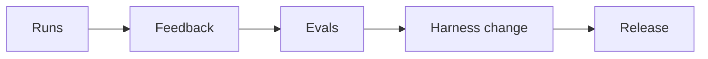
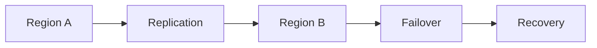

# Day 50 — Continuous agent improvement loops + Multi-region architecture and disaster recovery

!!! tip "Daily reps (~60–90 min)"
    Do both cards. Run each DO THIS lab, answer each checkpoint aloud before rereading.

## AI card — Continuous agent improvement loops

**What to learn, in order:** Connect traces, human judgment, evals, code changes, and release gates without letting an agent self-deploy blindly.

**Linear learning path**

1. Trace real behavior
2. Convert feedback to evals
3. Propose harness changes
4. Require measured improvement before promotion

!!! example "DO THIS"
    Create one loop where a traced failure becomes a new eval and a proposed tool/prompt change.

!!! question "Mid-senior checkpoint"
    Which parts of the improvement loop can be automated before the eval gate is highly trusted?

**Sources**

- Required: [Build an Agent Improvement Loop - OpenAI](https://developers.openai.com/cookbook/examples/agents_sdk/agent_improvement_loop) — Connects real traces, human/model feedback, reusable evals, and reviewed harness changes into an improvement flywheel.
- Official / deep: [Putting Evals Into Production - Hamel Husain](https://hamel.dev/notes/llm/ai-product-engineering/evals-production.html) — Shows how human labels, evaluator validation, and production samples become a continuous quality loop.

---

## System Design card — Multi-region architecture and disaster recovery

**What to learn, in order:** Design explicitly for region loss using RTO/RPO rather than vague "high availability" language.

**Linear learning path**

1. RTO/RPO
2. Active-passive vs active-active
3. Data replication lag
4. Failover testing

!!! example "DO THIS"
    Write a DR plan for a product with Postgres, object storage, queue, and cache.

!!! question "Mid-senior checkpoint"
    Which state can be reconstructed after disaster and which must be synchronously protected?

**Sources**

- Required: [Disaster Recovery Planning Guide - Google Cloud](https://cloud.google.com/architecture/dr-scenarios-planning-guide) — Framework for RTO/RPO, backup, failover, multi-region recovery, and DR scenario selection.
- Official / deep: [PostgreSQL High Availability and Replication](https://www.postgresql.org/docs/current/high-availability.html) — Official overview of replication and availability patterns for PostgreSQL systems.

---
*Source: `60_Days_AI_Engineering_System_Design_Roadmap_Anup_Dangi.pdf`, Day 50 cards. [Suggest a correction](https://github.com/AnupDangi/learnlikeadev/issues/new)*
