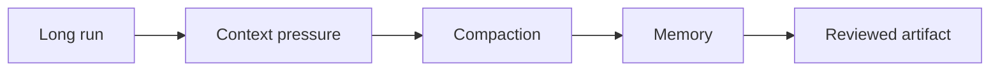
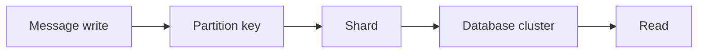

# Day 51 — Memory compaction and long-horizon execution + Discord: storing trillions of messages

!!! tip "Daily reps (~60–90 min)"
    Do both cards. Run each DO THIS lab, answer each checkpoint aloud before rereading.

## AI card — Memory compaction and long-horizon execution

**What to learn, in order:** Keep long-running agents coherent across context limits without making compressed conversation summaries the factual source of truth.

**Linear learning path**

1. Compact at meaningful boundaries
2. Preserve machine state separately
3. Store reusable workflow lessons as memory
4. Keep reviewed artifact authoritative

!!! example "DO THIS"
    Force a compaction checkpoint mid-task and verify that later work preserves critical state.

!!! question "Mid-senior checkpoint"
    What information may be safely summarized, and what must remain lossless?

**Sources**

- Required: [Building Reliable Agents with Memory and Compaction - OpenAI](https://developers.openai.com/cookbook/examples/agents_sdk/building_reliable_agents_memory_compaction) — Separates active-run compaction, reusable memory, and the reviewed artifact as distinct responsibilities.
- Official / deep: [Effective Context Engineering for AI Agents - Anthropic](https://www.anthropic.com/engineering/effective-context-engineering-for-ai-agents) — Explains compaction, structured note-taking, and context curation for long-horizon agents.

---

## System Design card — Discord: storing trillions of messages

**What to learn, in order:** Study partition design, hot partitions, database migration, and operational simplicity in a real high-scale workload.

**Linear learning path**

1. Message access pattern
2. Partition by channel/time
3. Cassandra operational pain
4. Migration to ScyllaDB

!!! example "DO THIS"
    Redesign a message table for channels that can live for years and have extreme traffic spikes.

!!! question "Mid-senior checkpoint"
    How do you stop one World-Cup-like channel from becoming one partition's bottleneck?

**Sources**

- Required: [How Discord Stores Trillions of Messages](https://discord.com/blog/how-discord-stores-trillions-of-messages) — Real evolution from MongoDB to Cassandra to ScyllaDB with partitioning, hot partitions, migrations, and latency lessons.
- Official / deep: [Partitioning GitHub Relational Databases](https://github.blog/engineering/infrastructure/partitioning-githubs-relational-databases-scale/) — Real migration showing how a large relational system moves toward partitioned database clusters.

---
*Source: `60_Days_AI_Engineering_System_Design_Roadmap_Anup_Dangi.pdf`, Day 51 cards. [Suggest a correction](https://github.com/AnupDangi/learnlikeadev/issues/new)*
