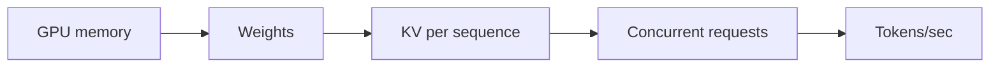
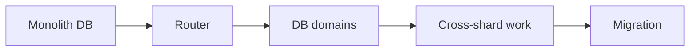

# Day 53 — GPU capacity, tokens/sec, and concurrency + GitHub: relational database partitioning

!!! tip "Daily reps (~60–90 min)"
    Do both cards. Run each DO THIS lab, answer each checkpoint aloud before rereading.

## AI card — GPU capacity, tokens/sec, and concurrency

**What to learn, in order:** Turn model-serving capacity into measurable token and memory budgets instead of requests/sec guesses.

**Linear learning path**

1. Weights vs KV memory
2. Prompt tokens vs output tokens
3. Throughput vs latency
4. Concurrency saturation

!!! example "DO THIS"
    For a hypothetical GPU/model, reserve memory for weights/runtime and estimate how many active 8k sequences fit.

!!! question "Mid-senior checkpoint"
    Why is RPS a misleading capacity unit for heterogeneous LLM workloads?

**Sources**

- Required: [vLLM: PagedAttention and High-throughput LLM Serving](https://arxiv.org/abs/2309.06180) — Explains KV-cache memory pressure, PagedAttention, and why serving throughput is a scheduling and memory problem.
- Official / deep: [Cost Optimization - OpenAI](https://developers.openai.com/api/docs/guides/cost-optimization) — Explains reducing requests, tokens, model size, and using batch/flex processing for lower cost.

---

## System Design card — GitHub: relational database partitioning

**What to learn, in order:** Study how a mature relational application can be partitioned without abandoning relational databases.

**Linear learning path**

1. Domain boundaries
2. Routing
3. Cross-partition queries
4. Incremental migration

!!! example "DO THIS"
    Shard repositories/issues by repository_id and list joins/transactions that become cross-partition.

!!! question "Mid-senior checkpoint"
    When should you split a database by domain instead of hashing every row?

**Sources**

- Required: [Partitioning GitHub Relational Databases](https://github.blog/engineering/infrastructure/partitioning-githubs-relational-databases-scale/) — Real migration showing how a large relational system moves toward partitioned database clusters.
- Official / deep: [PostgreSQL ALTER TABLE](https://www.postgresql.org/docs/current/sql-altertable.html) — Official schema-change mechanics and locking implications used when planning compatible migrations.

---
*Source: `60_Days_AI_Engineering_System_Design_Roadmap_Anup_Dangi.pdf`, Day 53 cards. [Suggest a correction](https://github.com/AnupDangi/learnlikeadev/issues/new)*
