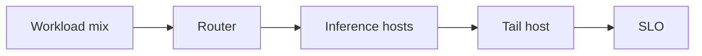
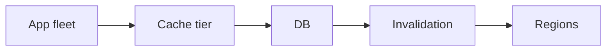

# Day 54 — Inference bottlenecks and utilization + Meta: Memcache at huge scale

!!! tip "Daily reps (~60–90 min)"
    Do both cards. Run each DO THIS lab, answer each checkpoint aloud before rereading.

## AI card — Inference bottlenecks and utilization

**What to learn, in order:** Diagnose the actual constrained resource instead of assuming high CPU/GPU utilization always means useful compute.

**Linear learning path**

1. GPU compute
2. Memory bandwidth/KV pressure
3. Queue time
4. Tail host utilization

!!! example "DO THIS"
    Benchmark mixed short/long requests and correlate p99 latency with queue depth and active tokens.

!!! question "Mid-senior checkpoint"
    Which load signal best predicts imminent inference saturation?

**Sources**

- Required: [Taming Tail Utilization of Ads Inference - Meta](https://engineering.fb.com/2024/07/10/production-engineering/tail-utilization-ads-inference-meta/) — Real inference-fleet case study showing why average utilization can hide saturated tail hosts.
- Official / deep: [vLLM - Open-source LLM inference and serving engine](https://github.com/vllm-project/vllm) — Implementation reference for continuous batching, paged KV cache, OpenAI-compatible serving, and benchmarks.

---

## System Design card — Meta: Memcache at huge scale

**What to learn, in order:** Study how caching changes when the system spans clusters, regions, invalidation streams, and hot keys.

**Linear learning path**

1. Regional cache tiers
2. Invalidation
3. Fan-out
4. Failure containment

!!! example "DO THIS"
    Design a multi-region profile cache and specify write invalidation and region-failure behavior.

!!! question "Mid-senior checkpoint"
    When can a cache architecture make a database outage more likely?

**Sources**

- Required: [Scaling Memcache at Facebook - Meta](https://engineering.fb.com/2013/04/15/core-infra/scaling-memcache-at-facebook/) — Shows regional caching, invalidation, hot keys, fan-out, and cache architecture at huge scale.
- Official / deep: [Redis Documentation](https://redis.io/docs/latest/) — Reference for in-memory data structures, caching, persistence, replication, clustering, and operational behavior.

---
*Source: `60_Days_AI_Engineering_System_Design_Roadmap_Anup_Dangi.pdf`, Day 54 cards. [Suggest a correction](https://github.com/AnupDangi/learnlikeadev/issues/new)*
