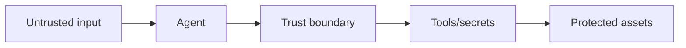
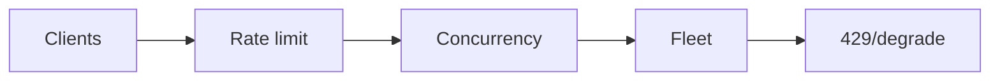

# Day 56 — Production AI security threat model + Stripe: rate limiting and API reliability

!!! tip "Daily reps (~60–90 min)"
    Do both cards. Run each DO THIS lab, answer each checkpoint aloud before rereading.

## AI card — Production AI security threat model

**What to learn, in order:** Combine prompt-injection risk, permissions, sandboxing, secrets, tool side effects, and auditability into one explicit threat model.

**Linear learning path**

1. Assets and trust boundaries
2. Untrusted inputs
3. Agent capabilities
4. Detection, containment, recovery

!!! example "DO THIS"
    Create a data-flow threat model for a research agent with web, files, GitHub, and shell tools.

!!! question "Mid-senior checkpoint"
    Which control prevents catastrophic damage even when every higher-level behavioral safeguard fails?

**Sources**

- Required: [How We Contain Claude Across Products - Anthropic](https://www.anthropic.com/engineering/how-we-contain-claude) — Production lessons on sandboxing, scoped credentials, network boundaries, and limiting agent blast radius.
- Official / deep: [Prompt Injection - OWASP GenAI Security](https://genai.owasp.org/llmrisk/llm01-prompt-injection/) — Threat-model reference for untrusted instructions entering through user content, tools, retrieval, and external sources.

---

## System Design card — Stripe: rate limiting and API reliability

**What to learn, in order:** Study production admission control as fairness and reliability engineering, not simply "requests per minute".

**Linear learning path**

1. Request-rate limit
2. Concurrent-request limit
3. Fleet capacity protection
4. Worker-utilization protection

!!! example "DO THIS"
    Implement two limiters: per-user token bucket and service-wide concurrency cap.

!!! question "Mid-senior checkpoint"
    How should limits differ for a cheap read and a 30-second export operation?

**Sources**

- Required: [Scaling Your API with Rate Limiters - Stripe](https://stripe.com/blog/rate-limiters) — Production design for request rate limits, concurrency limits, fleet protection, and worker-utilization controls.
- Official / deep: [Addressing Cascading Failures - Google SRE](https://sre.google/sre-book/addressing-cascading-failures/) — Explains overload, retry storms, load shedding, capacity planning, and preventing failure propagation.

---
*Source: `60_Days_AI_Engineering_System_Design_Roadmap_Anup_Dangi.pdf`, Day 56 cards. [Suggest a correction](https://github.com/AnupDangi/learnlikeadev/issues/new)*
