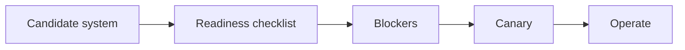

# Day 58 — AI production readiness and launch review + Cloudflare: stateful coordination with Durable Objects

!!! tip "Daily reps (~60–90 min)"
    Do both cards. Run each DO THIS lab, answer each checkpoint aloud before rereading.

## AI card — AI production readiness and launch review

**What to learn, in order:** Convert everything learned into an explicit pre-launch contract: evals, budgets, security, observability, overload behavior, and rollback.

**Linear learning path**

1. Quality/eval gate
2. Security capability boundary
3. Latency/cost/SLO
4. Rollback/degradation plan

!!! example "DO THIS"
    Run a launch review on one existing AI project and produce a red/yellow/green checklist.

!!! question "Mid-senior checkpoint"
    What would make you refuse to launch despite strong demo quality?

**Sources**

- Required: [API Deployment Checklist - OpenAI](https://developers.openai.com/api/docs/guides/deployment-checklist) — Current deployment checklist spanning model choice, reasoning budgets, tools, compaction, caching, and reliability.
- Official / deep: [Production Best Practices - OpenAI](https://developers.openai.com/api/docs/guides/production-best-practices) — Production checklist for reliability, latency, usage limits, and operational safeguards.

---

## System Design card — Cloudflare: stateful coordination with Durable Objects

**What to learn, in order:** Study a real alternative to "stateless service + distributed lock + cache + DB" for strongly scoped coordination.

**Linear learning path**

1. Unique object identity
2. State locality
3. Serialized coordination
4. Global system vs per-key state

!!! example "DO THIS"
    Design one Durable Object per collaborative room and list what global data should stay elsewhere.

!!! question "Mid-senior checkpoint"
    When does single-owner state simplify correctness but constrain throughput?

**Sources**

- Required: [Durable Objects Best Practices - Cloudflare](https://developers.cloudflare.com/durable-objects/best-practices/rules-of-durable-objects/) — Reference for stateful coordination using uniquely addressed durable compute and storage.
- Official / deep: [Eliminating Cold Starts 2: Shard and Conquer - Cloudflare](https://blog.cloudflare.com/eliminating-cold-starts-2-shard-and-conquer/) — Production example of consistent hashing, stable ownership, locality, and remapping under node churn.

---
*Source: `60_Days_AI_Engineering_System_Design_Roadmap_Anup_Dangi.pdf`, Day 58 cards. [Suggest a correction](https://github.com/AnupDangi/learnlikeadev/issues/new)*
