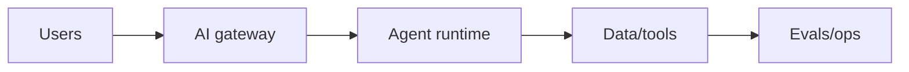

# Day 59 — Design a full production AI platform + Google Dapper + SRE synthesis

!!! tip "Daily reps (~60–90 min)"
    Do both cards. Run each DO THIS lab, answer each checkpoint aloud before rereading.

## AI card — Design a full production AI platform

**What to learn, in order:** Synthesize RAG, agents, memory, evals, inference, security, budgets, and operations into one coherent architecture.

**Linear learning path**

1. Separate control/data planes
2. Choose deterministic vs agentic paths
3. Define persistence/ownership
4. Attach observability and eval gates

!!! example "DO THIS"
    Design a production research/coding platform and write one-page trade-offs for each major subsystem.

!!! question "Mid-senior checkpoint"
    Which component would you intentionally keep simple until usage proves otherwise?

**Sources**

- Required: [A Practical Guide to Building AI Agents - OpenAI](https://openai.com/business/guides-and-resources/a-practical-guide-to-building-ai-agents/) — Production-oriented overview of when to use agents, how to orchestrate them, and how to apply safeguards.
- Official / deep: [Agents SDK Guide - OpenAI](https://developers.openai.com/api/docs/guides/agents/sdk) — Current reference for agent definitions, tools, orchestration, state, guardrails, and observability.

---

## System Design card — Google Dapper + SRE synthesis

**What to learn, in order:** Connect request tracing with SLO-driven operations so architecture decisions become observable in production.

**Linear learning path**

1. Trace critical paths
2. Define user-journey SLO
3. Locate saturation/failure
4. Use evidence for capacity and release decisions

!!! example "DO THIS"
    Take a 5-service request path and define spans, metrics, logs, SLO, and one burn-rate alert.

!!! question "Mid-senior checkpoint"
    Which observability signal would prove a downstream fan-out is causing tail latency?

**Sources**

- Required: [Dapper: Large-Scale Distributed Tracing Infrastructure - Google](https://research.google/pubs/dapper-a-large-scale-distributed-systems-tracing-infrastructure/) — Foundational tracing paper for reconstructing one request across many distributed services.
- Official / deep: [Alerting on SLOs - Google SRE Workbook](https://sre.google/workbook/alerting-on-slos/) — Shows how error budgets and multi-window burn-rate alerts create actionable reliability paging.

---
*Source: `60_Days_AI_Engineering_System_Design_Roadmap_Anup_Dangi.pdf`, Day 59 cards. [Suggest a correction](https://github.com/AnupDangi/learnlikeadev/issues/new)*
